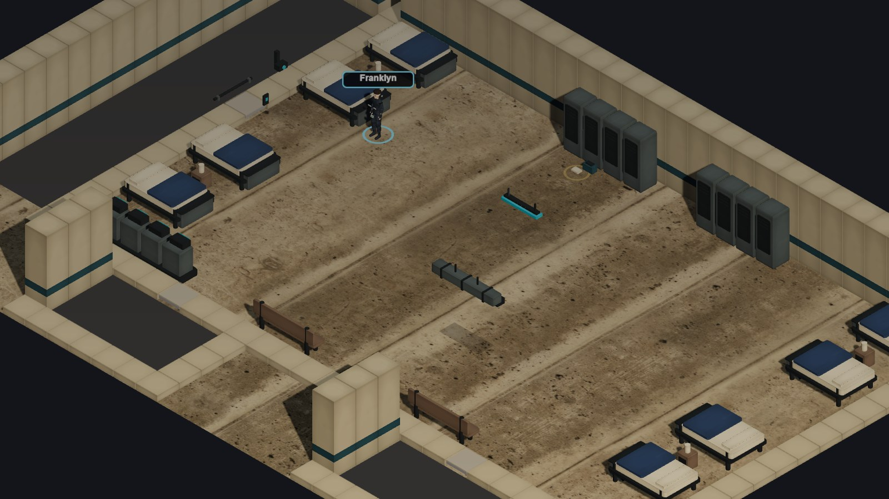
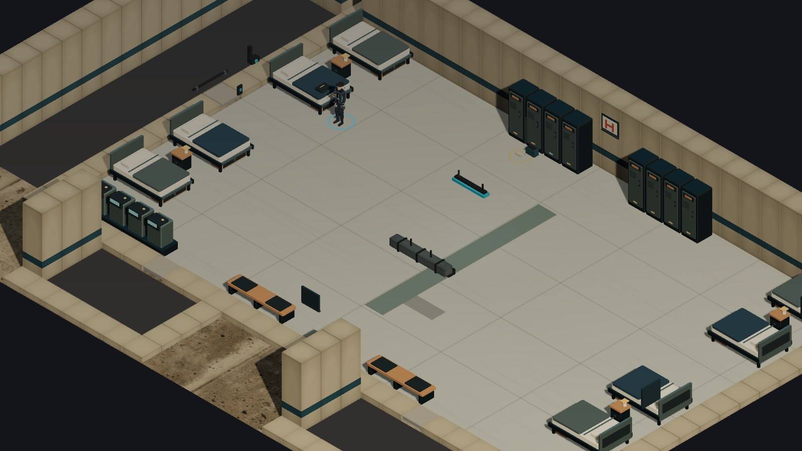

# Revue — pilote autonome du dortoir

**25 septembre 2026.** Scène jouable livrée comme page de développement, isolée de la
progression et des sauvegardes du chapitre 1. Le pilote mesure ce que le rendu Three.js
actuel peut gagner par la silhouette, le mobilier et la composition. Il ne constitue pas
une validation de qualité « AA ».

## Lancer et rejouer

```bash
npm install
npm run dev
```

- Pilote : `http://localhost:5173/cyberpunk-holt/dormitory-pilot.html`
- Ancien décor et ancien Franklyn **sur la même carte** : ajouter `?quality=baseline`
- Captures sans interface : ajouter `?hud=0` (et `&hud=0` au mode baseline)
- Chapitre réel, référence de départ :
  `http://localhost:5173/cyberpunk-holt/?seed=visual-review&scene=ch1.vers-cantine`

Le clic déplace Franklyn ; `A`/`E` tournent la caméra, `C` recentre, la molette zoome et
les flèches déplacent la caméra. La copie conserve les 25 × 15 cases intérieures, le
couloir ouest et deux seuils sud de quelques cases. La graine visuelle est fixée à
`dormitory-pilot-visuals`. L'apparition locale est `(8,5)`, soit `(29,5)` dans HOLT.

**Séquence de mouvement reproductible :** depuis l'apparition, cliquer sur l'allée
centrale `(17,8)`, puis sur le seuil de la cour `(10,18)`, celui de la cantine `(23,18)`
et enfin le couloir ouest `(2,7)` ; `C` ramène Franklyn dans le cadre. Le mode de
comparaison accepte exactement le même trajet. Les clics réels ont atteint les quatre
cases dans le navigateur ; les tests de grille couvrent aussi le casier et les lits est.

## Direction retenue

Les **huit lits simples** du plan actuel ont été gardés. Le dialogue d'ouverture et le
brief D01 évoquent des lits superposés ; changer seulement les meshes aurait créé une
discordance de collision. L'intégration éventuelle devra harmoniser dialogue,
illustration, carte et décor dans un même lot. La vue isométrique sans plafond demande
une composition différente de l'illustration 21:9 à hauteur d'homme.

Le kit nouveau dessine un châssis ouvert sous chaque lit, matelas, drap, couverture,
oreiller, tiroir et tête métallique ; le lit de Franklyn porte aussi une veste pliée.
Les casiers ont des portes, aérations, poignées, plaques et voyants, avec un signal
distinct pour le sien. Chevets, bancs et contrôle de présence ont des assemblages plus
lisibles. Le sol peint, le chemin central, les emblèmes HOLT et les vitrages techniques
calment la grande surface de béton et signalent une académie entretenue et surveillée.
Les emblèmes suivent la coupe des murs aux quatre orientations.

Franklyn garde les clips **sur place** du squelette Quaternius, mais sa silhouette pilote
reçoit un blouson plus ajusté à col montant, un zip, des épaulettes, des plaques et un
neuroport discret. Sa largeur est réduite et sa coiffure est courte et irrégulière.
Le rig du chapitre et les cinq autres cadets sont inchangés. La vitesse de jeu reste
`LEADER_SPEED = 4` cases/s ; le rendu n'ajoute aucun déplacement racine.

## Preuves visuelles

Les deux premières images ci-dessous proviennent du **même MapDef pilote** et du même
renderer : viewport 1600 × 900, DPR 1, zoom 16, orientation 0, ACES exposition 1,08,
ombres PCFSoft, aucun HUD. Elles comparent donc le coût et l'image à périmètre égal.
La capture du chapitre rend l'académie entière et sert seulement de contexte visuel.

| Avant, même carte | Après, même carte |
| --- | --- |
|  |  |

- [Référence du chapitre réel](dormitory-chapter-before.jpg) — URL ci-dessus, graine
  `visual-review`, viewport 1600 × 900, DPR 1, orientation 0, zoom initial 16.
- [Franklyn avant](dormitory-pilot-baseline-close.jpg) et
  [Franklyn après](dormitory-pilot-pilot-close.jpg) — même carte, recentrage sur lui,
  zoom 11. La [planche des quatre orientations réelles](dormitory-pilot-franklyn-board.jpg)
  utilise le zoom minimal 10, sans étiquette.
- [Orientation 2](dormitory-pilot-angle-2.jpg),
  [orientation 3](dormitory-pilot-angle-3.jpg) et
  [1280 × 720](dormitory-pilot-1280.jpg) — contrôle du cadrage, des murs et du seuil.
- [Marche en cours](dormitory-pilot-moving.jpg) — capture réelle pendant un trajet à
  4 m/s ; la recette ci-dessus permet de revoir le virage et l'arrêt en continu.

La cible de travail était : blouson NCPD bleu-noir, taille mince et âge adolescent,
cheveux châtains courts, équipement retenu ; chambre rangée mais vécue, lits/casiers
distincts, contrôle d'accès, lumière du jour et ombres pétrole. La planche des quatre
orientations sert désormais de contrôle : elle montre aussi où cette cible manque.

## Observation et coûts

Première revue de la copie : (1) le béton photo semblait sale pour une école entretenue,
(2) les lits et casiers répétaient des volumes anonymes, (3) la veste ajoutée à Franklyn
avait un torse carré et des mèches pointues. Les deux premiers ont conduit au sol peint,
au chemin et au mobilier assemblé ; le troisième à une veste resserrée et une coiffure
moins anguleuse. Les comparaisons ci-dessus ont été refaites après ces corrections.

Mesure navigateur automatisé, **SwiftShader logiciel** sous Chromium, 1600 × 900, DPR 1,
90 images par mode. Les temps d'image ci-dessous portent sur les 60 dernières images ;
les temps de `renderer.render` sont des temps CPU, pas des temps GPU. Les oscillations de
cadence de la boucle du navigateur dominent les résultats : les deux médianes d'image
autour de 250 ms ne prouvent aucune différence de fluidité sur une carte graphique.

| Même carte pilote | Ancien kit | Nouveau kit |
| --- | ---: | ---: |
| Temps d'image médian / p95 | 249,9 / 266,6 ms | 250,0 / 266,7 ms |
| Appel `renderer.render` médian / p95 | 1,7 / 2,7 ms | 2,3 / 3,2 ms |
| Appels de dessin visibles | 59 | 104 |
| Triangles visibles | 91 094 | 93 716 |
| Géométries / textures déclarées par Three.js | 43 / 21 | 81 / 19 |
| Ressources reçues après chargement, page Vite dev | 8 564 777 o | 8 564 777 o |
| Tas JS approximatif Chromium | 35,1 Mo | 39,6 Mo |

Les pages dev importent toutes deux le code des deux modes : le transfert égal ne mesure
pas le poids d'une future intégration de production. Le navigateur ne fournit pas ici
un budget VRAM GPU. Le pilote reste sous les alertes de 250 appels et 300 000 triangles
visibles, mais celles-ci ne valent pas preuve de 60 fps en 1920 × 1080 sur GTX 1070 ;
**cette carte n'était pas disponible pour le test**. Une mesure matérielle reste nécessaire
avant généralisation.

`npm run verify` a passé typecheck, lint, **391 tests unitaires** et build. Les **six tests
Playwright** de `tests/e2e/explore.spec.ts` ont passé, dont le chapitre du réveil au fourgon,
de vrais clics canvas et une reprise de sauvegarde. Le pilote n'a produit aucune erreur
JavaScript pendant les captures et les quatre trajets au clic.

## Provenance et limites

Les nouveaux lits, casiers, chemin, signes, textile et sol sont des géométries ou une
texture Canvas générées localement dans le code. Aucun asset lourd, master, licence payante,
compte tiers ou service d'auto-rigging n'a été ajouté. Le squelette, les clips et la tête
masculine proviennent des GLB Quaternius déjà distribués et crédités dans
[ART-PIPELINE.md](ART-PIPELINE.md) et
[`public/assets/exploration/ATTRIBUTION.md`](../../public/assets/exploration/ATTRIBUTION.md).
Les sols et autres props de repli réemploient les ressources déjà créditées par le projet.

La pièce est **visiblement plus précise et cohérente** à cadrage égal. Elle reste en deçà
d'un rendu AA stylisé : au zoom normal, l'uniforme et la coupe se lisent, mais l'identité
de Franklyn sans étiquette reste faible ; le visage et les mains du modèle source sont
sommaires, la veste ajoutée demeure géométrique et certaines surfaces murales sont
encore des blocs. La planche rapprochée ne montre pas de déformation flagrante à l'arrêt ;
le clip Quaternius reste raide pendant la marche et la cadence logicielle ne permet pas
de conclure sur l'absence de glissement des pieds. La scène n'établit donc pas le critère
personnage du mandat, même si le trajet et les quatre cadrages fonctionnent.

**Revue du propriétaire, 25 septembre 2026 : le résultat reste trop sommaire et peu beau.**
Ce jugement invalide l'usage de ce pilote comme preuve d'une qualité AA. Les meubles
assemblés dans Three.js et le blouson ajouté au rig n'ont pas créé la différence attendue
avec les références. La prochaine passe commence par un vrai modèle de Franklyn : une
base Mixamo déjà riggée, modifiée dans Blender, testée sur une animation de marche dans
le même dortoir. [La procédure préparée](MIXAMO-PILOT.md) attend un FBX téléchargé après
connexion Adobe ; le convertisseur seul ne vaut pas nouveau résultat artistique.

Réemploi probable par un développeur seul : environ **5 à 10 jours** pour donner aux cinq
autres cadets une variante géométrique de ce niveau et les revoir en mouvement ; environ
**2 à 4 semaines** pour décliner le kit et corriger les collisions/visibilités des autres
salles de l'académie. Un vrai saut de qualité des personnages demanderait d'abord un mesh
et des animations plus aboutis, avec rigging et validation des déformations : coût non
mesuré par ce pilote, probablement plusieurs semaines supplémentaires. Il n'y a pas de
preuve qu'un changement de moteur soit nécessaire ; il n'y a pas non plus de base pour
intégrer ce rendu tel quel au chapitre. L'étape suivante proposée est un Franklyn final
modélisé et animé, jugé sur la même planche et le même trajet, puis seulement une décision
de généralisation.
