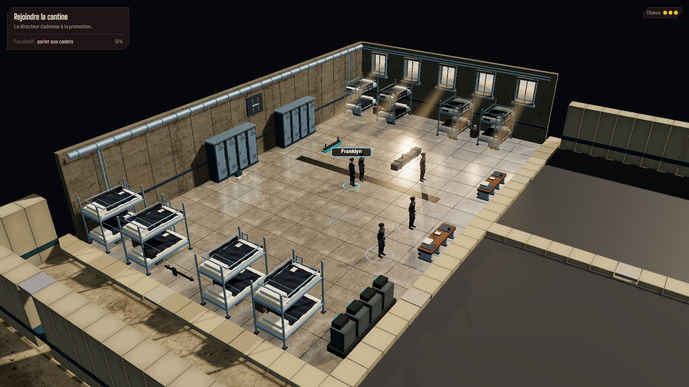

# Dortoir intégré — reprise vers le pilote, 1er octobre 2026

Cette revue remplace l'appréciation visuelle de la
[première intégration](DORMITORY-AAA-INTEGRATION-REVIEW.md). Le mobilier y avait été
repris du pilote ; sa coque, sa perspective et son rendu complet restaient à intégrer.
La reprise est autorisée par [l'ADR 0036](../process/adr/0036-rendu-dortoir-fidele-au-pilote.md),
réalisée avec des agents GPT-6 Luna puis vérifiée par l'orchestrateur.

## Ce qui est intégré

Les façades nord et est ont leur propre architecture : béton texturé, joints,
fixations, plaque du dortoir, conduites murales et ouvertures réelles. Les murs
atteignent 4,9 m comme dans l'étude. Cinq fenêtres de 1,24 × 1,52 m remplacent les
anciennes bandes de vitrage. Le paysage des Badlands est limité aux ouvertures ;
il ne forme plus un panneau flottant au-dessus de la pièce.

La caméra passe en perspective dans le dortoir, avec le champ de 39° et l'élévation
du pilote. Le contrôleur de caméra existant garde le cadrage, le zoom et les quatre
quarts de tour. Le picking et les étiquettes utilisent la caméra de rendu. La coupe
remplace les façades proches par des parapets de 40 cm et retire aussi leurs détails.
Le couloir et les seuils sud restent raccordés à la carte existante.

Le sol utilise le quadrant béton poli de l'atlas du pilote, avec ses joints et son
relief fin. Un environnement PMREM apporte les reflets de matière ; une réflexion
planaire de 768 × 768, filtrée sur neuf échantillons, reprend réellement les objets.
Une adaptation de projection conserve ce reflet avec la caméra orthographique
utilisée hors du dortoir. Le traitement d'image comprend bloom et sortie ACES.
Les joints et l'insert presque coplanaires utilisent un biais de profondeur pour
éviter leur scintillement contre le sol dans le cadrage perspective de la grande pièce.

La lumière des fenêtres ajoute des ombres locales de 4096 × 4096, des rayons et des poussières
déterministes. Le profil nocturne suit les ambiances du chapitre 2. L'activation de
la lumière et du compositeur dépend de la présence du meneur dans le dortoir ;
l'architecture et le reflet restent visibles depuis la carte après découverte.
Le bloom (`0,19 / 0,5 / 1,6`) et l'exposition `1,2` reprennent le pilote ; ils
traitent l'image entière pendant ce profil, y compris une salle adjacente cadrée.
L'exposition précédente est restaurée après chaque image.
Les poutres, gaines et réglettes suspendues qui masquaient les occupants ont été retirées.

Les lits, casiers, bancs et affaires personnelles utilisent le kit dédié de la
première intégration. Les règles, collisions, entités, sauvegardes et parcours
conservent leur contrat. Les fichiers des personnages et leurs animations n'ont
pas été modifiés pendant cette reprise.

## Reproduction et limites

Avec `npm run dev`, ouvrir :

```text
http://localhost:5173/cyberpunk-holt/?scene=ch1.vers-cantine&seed=dormitory-integration
```

Clic au sol pour marcher ; `C` pour recentrer ; `A`/`E` pour tourner ; molette pour
zoomer. Le chapitre 2 se lance avec `?scene=ch2.bal&seed=dormitory-integration` ; le
dortoir doit être découvert sur cette carte. Son casier reste sans interaction.
L'étude autonome demeure accessible à `/cyberpunk-holt/dormitory-aaa.html`.

Le chapitre garde une pièce de 25 × 15 cases et huit lits, face aux 15 × 12 m et
cinq lits de l'étude. Le soleil est une source locale pour éviter de relighter
toute l'académie. La composition et les autres salles visibles au dézoom expliquent
donc des différences avec le cadrage autonome. Cette reprise ne constitue pas une
copie pixel pour pixel de l'étude ni une validation des futurs niveaux.

## Captures réelles

Les JPEG viennent du navigateur, sans retouche artistique, par conversion
System.Drawing à qualité 82. Le viewport est 1920 × 1080, DPR 1, graine
`dormitory-integration`. La vue principale centre le meneur `(38,8)` avec `C`,
puis dézoome de 100 unités de molette ; les angles et mesures larges utilisent 320.
La référence est une capture acceptée de l'étude, pas une nouvelle cible générée.

| Vue                             | Capture                                                               |
| ------------------------------- | --------------------------------------------------------------------- |
| Pilote accepté                  | [pilot-reference.jpg](reviews/dormitory-fidelity/pilot-reference.jpg) |
| Reprise, vue principale         | [after-hero.jpg](reviews/dormitory-fidelity/after-hero.jpg)           |
| Quart de tour                   | [after-quarter.jpg](reviews/dormitory-fidelity/after-quarter.jpg)     |
| Orientation opposée             | [after-opposite.jpg](reviews/dormitory-fidelity/after-opposite.jpg)   |
| Quatrième angle                 | [after-fourth.jpg](reviews/dormitory-fidelity/after-fourth.jpg)       |
| Dortoir nocturne découvert      | [after-night.jpg](reviews/dormitory-fidelity/after-night.jpg)         |
| Seuil nocturne avant découverte | [after-hidden.jpg](reviews/dormitory-fidelity/after-hidden.jpg)       |
| HOLT au dézoom maximal          | [after-wide.jpg](reviews/dormitory-fidelity/after-wide.jpg)           |
| Redimensionnement 1280 × 720    | [after-720.jpg](reviews/dormitory-fidelity/after-720.jpg)             |



## Mesures et validation

Build Vite de production, `main-_ONp6K-E.js` (577,87 Ko, 167,85 Ko gzip), Chromium
153.0.8010.12, ANGLE D3D11 sur NVIDIA GeForce GTX 1070. Le relevé porte sur
600 intervalles RAF par vue après échauffement : cadence du navigateur, pas temps
GPU isolé. La cible est p95 ≤ 33,3 ms. Les compteurs incluent rendu principal,
ombres, réflexion et post-traitement ; les personnages présents sont comptés.
Les données complètes figurent dans [metrics.json](reviews/dormitory-fidelity/metrics.json).

| Vue            | DPR | Médiane |     p95 |     p99 | Appels, toutes passes | Triangles, toutes passes |
| -------------- | --: | ------: | ------: | ------: | --------------------: | -----------------------: |
| Dortoir jour   |   1 | 16,7 ms | 16,8 ms | 16,8 ms |                   815 |                1 819 668 |
| Dortoir nuit   |   1 | 16,7 ms | 16,8 ms | 16,8 ms |                   585 |                1 898 374 |
| HOLT vue large |   1 | 16,7 ms | 16,7 ms | 16,8 ms |                   769 |                1 891 582 |
| Dortoir jour   | 1,5 | 16,7 ms | 16,8 ms | 16,8 ms |                   800 |                1 819 508 |
| Dortoir nuit   | 1,5 | 16,7 ms | 16,7 ms | 16,8 ms |                   559 |                1 861 092 |
| HOLT vue large | 1,5 | 16,7 ms | 16,7 ms | 16,8 ms |                   769 |                1 891 582 |

Le DPR 1,5 produit un canvas de 2880 × 1620 pour le même viewport CSS. Les six
échantillons tiennent la cible de 30 ips, sans retirer les effets. Les compteurs
décrivent la dernière image de chaque échantillon ; ils varient avec les objets
visibles et les animations. Une cadence proche de 60 ips ne mesure pas la réserve
GPU disponible au-delà du plafond de présentation du navigateur.

Après trois cycles HOLT → centre d'examen → HOLT-nuit, les deux derniers retours
nocturnes ont 159 géométries et 100 textures en DPR 1 ; les trois relevés ont ces
mêmes valeurs en DPR 1,5. La comparaison garde le pointeur sur le même sol pour
charger le marqueur de survol à chaque retour, car sa géométrie est envoyée au GPU
à la demande. Le premier retour en DPR 1 a 160 géométries, puis les valeurs se
stabilisent. Le resize à 1280 × 720 conserve 159 géométries et 100 textures ; le canvas fait 1920 × 1080 au
DPR 1,5. Aucun défaut de page, console ou requête dans ces deux revues.

La découverte nocturne reste indépendante de celle du jour. La pièce inconnue ne
montre ni occupants ni reflet ; les quatre orientations retirent les fenêtres et
conduites avec leur façade. Les tests de chargement confirment le remplacement de
l'atlas dans les clones de texture, le repli procédural après échec réseau et
l'abandon des callbacks après destruction. Les neuf fichiers des modèles et outils
de personnages suivis au début de la séance ont conservé leur SHA-256.

`npm run verify` passe : typecheck, lint, **749 tests dans 47 fichiers**, build.
Le test de projection du reflet couvre quatre orientations et deux zooms ; il
vérifie le plan de coupe et la restitution de l'état du renderer après erreur.
Les **huit parcours Playwright** de `explore.spec.ts` et `chapter2.spec.ts` passent,
avec vrai clic sur le casier, interactions au canvas, reprises et enchaînement des
deux chapitres. Chromium utilise un worker et
`--use-angle=d3d11 --enable-gpu --ignore-gpu-blocklist`.

Les neuf JPEG totalisent 1,87 Mio. Les PNG de travail restent dans `.dream-loop/`,
ignoré par Git. Aucun nouveau fichier de matière n'est ajouté au jeu.

## Corrections après validation du propriétaire

Le 1er octobre, le propriétaire valide le décor et signale deux détails d'interface.
Le rayon de sélection utilisait encore la caméra orthographique malgré l'affichage
en perspective : survol et clic utilisent désormais `renderCamera`. Un contrôle
navigateur de 78 centres de cases, aux quatre angles, à deux zooms et DPR 1/1,5,
retrouve chaque case. L'écart maximal entre projection du sol et centre de l'anneau
est de 1,31 px, dû à sa hauteur de 0,03 m ; l'anneau reste centré sur la case visée.

Le nom permanent de Franklyn était un sprite 3D, donc réfléchi par le sol. Les noms
du groupe sont désormais affichés par l'infobulle HTML au survol ou à l'appui.
Le clic sur un membre du groupe l'identifie sans lui envoyer de déplacement ; les
PNJ conservent leur interaction. Le sprite est masqué dans toutes les passes de
rendu. Un vrai appui tactile dans Chromium confirme le placement au contact,
la persistance après relâchement et la fermeture après un appui ailleurs ; la
sortie souris ferme aussi l'infobulle. Aucun défaut de page dans cette revue.

Le test unitaire de visée couvre les deux projections, les rotations et les zooms,
ainsi que l'identification du groupe et les enfants cachés. `npm run verify` et les
six parcours de `explore.spec.ts` passent après ces corrections. Les scripts,
résultats et la capture de l'infobulle restent dans `.dream-loop/dormitory-fidelity/`.

La suite demandée est consignée dans le
[plan de l'école pièce par pièce](../process/HOLT-AAA-ROLLOUT-PLAN.md), comprenant
tous les murs intérieurs et les familles de portes.
