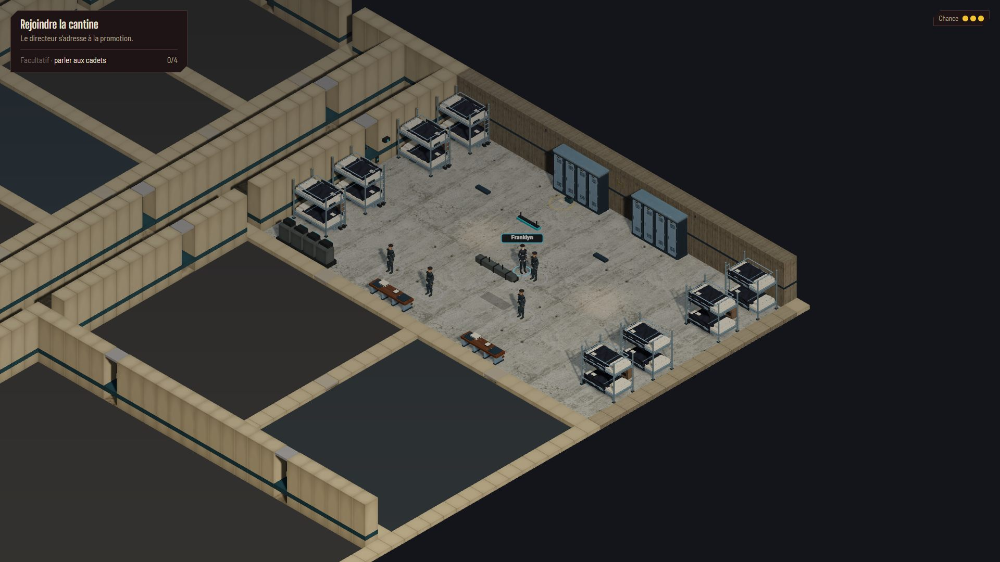

# Dortoir AAA intégré — revue du 30 septembre 2026

**Historique de la première intégration.** Le 1er octobre, le propriétaire juge ce
rendu en retrait du pilote, notamment sur les murs, la lumière et les reflets.
La reprise vise ces écarts sous [l'ADR 0036](../process/adr/0036-rendu-dortoir-fidele-au-pilote.md).
Les mesures et captures ci-dessous décrivent la première version, pas cette reprise.
Le résultat actuel est décrit dans [la revue du 1er octobre](DORMITORY-AAA-FIDELITY-REVIEW.md).

Le décor de l'étude autonome est raccordé au vrai dortoir de HOLT et à sa variante
nocturne, avec la caméra et le plan du chapitre. Le jalon est produit par deux agents
GPT-6 Luna, pilotés et vérifiés par l'orchestrateur. Les lots D0–D5 sont terminés,
les parcours passent et la cible de 30 ips est tenue sur les vues mesurées.

## Résultat et reproduction

Huit lits superposés remplacent les lits simples dans leurs emprises actuelles :
cadres tubulaires, échelles, garde-corps, matelas, oreillers, linge plissé et affaires
personnelles. Deux rangées de casiers et deux bancs utilisent le kit dédié. Le sol
reprend le béton gris de l'atlas existant ; les métaux ont des reflets doux préfiltrés.
Deux bandes de baies hautes sont placées sur la façade est, avec finitions sombres,
gaine et réglettes. La lumière de nuit suit les étapes du chapitre 2.

Avec `npm run dev`, ouvrir :

```text
http://localhost:5173/cyberpunk-holt/?scene=ch1.vers-cantine&seed=dormitory-integration
```

Cliquer au sol pour marcher ; cliquer sur le casier pour l'examiner. `C` recentre,
`A`/`E` font pivoter la caméra et la molette zoome. Le dortoir du chapitre 2 se teste
avec `?scene=ch2.bal&seed=dormitory-integration` : marcher depuis la cantine vers le
dortoir, encore inconnu sur cette carte. Son casier est du décor sans interaction.

Les règles, collisions, progression, sauvegardes et emplacements d'entités sont
conservés. Les fichiers des personnages et leurs animations ne sont pas modifiés.
Les modèles `bed-cadet` et `locker-bank` restent utilisés ailleurs, notamment dans
les conduits. La scène autonome `dormitory-aaa.html` demeure disponible séparément.

## Captures réelles

Ces images viennent du jeu lancé, sans retouche artistique. JPEG qualité 82 depuis
les PNG Playwright, conversion System.Drawing, sept vues totalisant environ 1,04 Mio.
Les captures ne sont pas des cibles générées.

Graine `dormitory-integration`, 1920 × 1080, DPR 1. Jour et nuit : meneur `(38,8)`,
`C`, dézoom de 320 unités de molette. Le jour avant/après conserve la même recette.
La coupe suit les quatre orientations ; l'orientation opposée montre les fenêtres.

| Vue                                                  | Capture                                                                |
| ---------------------------------------------------- | ---------------------------------------------------------------------- |
| Jour avant intégration                               | [before-day.jpg](reviews/dormitory-integration/before-day.jpg)         |
| Jour après intégration                               | [after-day.jpg](reviews/dormitory-integration/after-day.jpg)           |
| Jour, orientation opposée                            | [after-opposite.jpg](reviews/dormitory-integration/after-opposite.jpg) |
| Nuit après découverte                                | [after-night.jpg](reviews/dormitory-integration/after-night.jpg)       |
| Nuit, seuil sans découverte                          | [after-hidden.jpg](reviews/dormitory-integration/after-hidden.jpg)     |
| HOLT, plusieurs salles découvertes et dézoom maximal | [after-wide.jpg](reviews/dormitory-integration/after-wide.jpg)         |
| Redimensionnement à 1280 × 720                       | [after-720.jpg](reviews/dormitory-integration/after-720.jpg)           |



## Mesures de production

Build Vite vérifié, module principal `main-BZJQidHY.js` : 551,44 Ko brut,
158,80 Ko gzip. Chromium **153.0.8010.12**, ANGLE Direct3D11, GPU rapporté :
**NVIDIA GeForce GTX 1070 (0x00001B81), D3D11 vs_5_0 / ps_5_0**.
Le numéro de version du pilote Windows n'est pas exposé par cette mesure.

Chaque échantillon couvre 600 intervalles RAF après chargement et échauffement.
Cela mesure la cadence livrée au navigateur, pas un temps GPU isolé. Une médiane
proche de 16,7 ms indique une cadence plafonnée autour de 60 ips ; elle ne donne pas
la réserve exacte du GPU. Le critère demandé est **p95 ≤ 33,3 ms**, soit 30 ips.
Les relevés complets sont conservés dans [metrics.json](reviews/dormitory-integration/metrics.json).

| Vue, DPR 1     | Médiane |     p95 |     p99 | Appels, ombres incluses | Triangles toutes passes | Géométries | Textures |
| -------------- | ------: | ------: | ------: | ----------------------: | ----------------------: | ---------: | -------: |
| Dortoir jour   | 16,7 ms | 16,8 ms | 16,8 ms |                     353 |                 903 120 |        107 |       52 |
| Dortoir nuit   | 16,7 ms | 16,7 ms | 16,8 ms |                     426 |               1 002 502 |        140 |       71 |
| HOLT vue large | 16,7 ms | 16,8 ms | 16,8 ms |                     427 |               1 172 884 |        121 |       54 |

La vue large découvre dortoir, cantine, salles d'entraînement et garage via leurs
points d'apparition déclarés, puis cadre l'académie au dézoom maximal. Les compteurs
incluent le décor et les personnages actuellement présents. Les compteurs mémoire
varient aussi avec les ressources partagées chargées et les rigs visibles.

Le compteur `exploreRenderStats()` est corrigé pour inclure les ombres : Three le
remettait à zéro après leur passe. Le relevé avant intégration (168 appels,
127 260 triangles) ne comptait que la passe principale ; il n'est pas directement
comparable aux totaux ci-dessus. La forme de l'API publique est inchangée.

| Vue, DPR 1,5   | Médiane |     p95 |     p99 | Appels, ombres incluses | Triangles toutes passes |
| -------------- | ------: | ------: | ------: | ----------------------: | ----------------------: |
| Dortoir jour   | 16,7 ms | 16,7 ms | 16,8 ms |                     347 |                 902 792 |
| Dortoir nuit   | 16,7 ms | 16,7 ms | 16,8 ms |                     385 |                 991 232 |
| HOLT vue large | 16,7 ms | 16,8 ms | 16,8 ms |                     427 |               1 172 884 |

Le DPR 1,5 rend 2880 × 1620 pixels pour un viewport CSS de 1920 × 1080. Les deux
passages tiennent le critère dans les trois situations. Les compteurs décrivent
l'image rendue à la fin de chaque échantillon ; aucun profil de qualité ne retire
du décor au DPR 1,5. Aucun changement
de DPR global, de soleil global ou de caméra n'est introduit.

## Ressources, transitions et vérification

La session conserve un PMREM commun au jour et à la nuit. Le kit possède ses
géométries ; la bibliothèque possède ses matières et ses textures ; la vue possède
les clones de texture du sol et emprunte le PMREM. Les chargements d'atlas et de
bois gardent un repli procédural immédiat et ignorent les callbacks après destruction.
Un probe navigateur a confirmé le remplacement de l'image et l'invalidation des
clones, le repli après échec réseau et la protection des callbacks tardifs.

La revue a détecté puis corrigé des fuites antérieures : géométries créées directement
par les props et marqueurs, ombre du soleil et textures GPU de squelettes privés aux
rigs clonés. Le nettoyage passe par la destruction de la vue ; les personnages ne
changent pas d'apparence ou de comportement. Les modèles et matières des personnages
partagés restent sous leur propriétaire.

Après trois cycles **HOLT → centre d'examen → HOLT-nuit**, les mêmes retours nocturnes
donnent **140 géométries et 83 textures**, identiques aux trois relevés. Le compteur
inclut les caches conservés et le PMREM. Le resize à 1280 × 720 conserve ces valeurs.
La découverte nocturne reste distincte du jour et ne réintroduit pas le casier
interactif. Aucune erreur de page, de console ou de requête dans la revue finale.

`npm run verify` passe : typecheck, lint, **748 tests unitaires dans 46 fichiers**,
build. Les tests d'emprise vérifient les vrais volumes et accessoires du kit ; le
test global de placement limite les nouveaux modèles au dortoir HOLT/HOLT-nuit.
Les **huit tests navigateur** de `explore.spec.ts` et `chapter2.spec.ts` passent
en 1,4 minute : chapitre 1 de bout en bout avec vrai clic sur le casier, clics objet
et porte, reprise d'exploration et de porte, chapitre 2 complet, bal et grille au clic.
Le lancement utilise un seul worker et les options Chromium
`--use-angle=d3d11 --enable-gpu --ignore-gpu-blocklist` dans `launchOptions.args`.
Le build est lancé avant les tests si le serveur preview existe déjà, car
`reuseExistingServer` ne relance pas le build. Commande des suites :

```text
npm run test:e2e -- tests/e2e/explore.spec.ts tests/e2e/chapter2.spec.ts --workers=1
```

La configuration locale de mesure ajoute seulement les options GPU ci-dessus à la
configuration Playwright standard. Les outils temporaires et PNG originaux restent
dans `.dream-loop/dormitory-integration/`, ignoré par Git ; les captures JPEG et les
chiffres utiles à la reprise sont conservés avec cette revue.

## Provenance et limites

L'intégration ajoute **zéro fichier de texture de production**. L'atlas existant
fait 596 027 octets ; il a été généré pendant l'étude, avec son prompt et ses crédits
dans [ATTRIBUTION.md](../../public/assets/dormitory-aaa/ATTRIBUTION.md). Le bois réemploie
la texture CC0 de la cantine, 89 872 octets, créditée dans
[les matières d'exploration](../../public/assets/exploration/ATTRIBUTION.md).

La pièce reste grande, 25 × 15 cases, et la caméra orthographique lit davantage une
coupe d'académie que le cadrage perspective de la référence. Les fenêtres suivent
la vraie façade est ; le mur ouest partagé avec le couloir reste plein. Le sol reçoit
des reflets de matière, sans reflet planaire. Bloom et poussière ne sont pas portés.
Ces choix limitent le coût et conservent la lisibilité du chapitre ; le résultat ne
reproduit pas à l'identique la capture du pilote autonome.

Les tests ciblent ce matériel et ces vues ; ils ne certifient pas une carte intégrée,
un rendu logiciel ni les futures variantes de personnages. L'extension aux autres
pièces nécessite leur composition, leurs matières et leur propre revue ; voir
[l'estimation mise à jour](EXPLORATION-DECOR-ROLLOUT.md) et
[le plan exécuté](../process/DORMITORY-AAA-INTEGRATION-PLAN.md).
