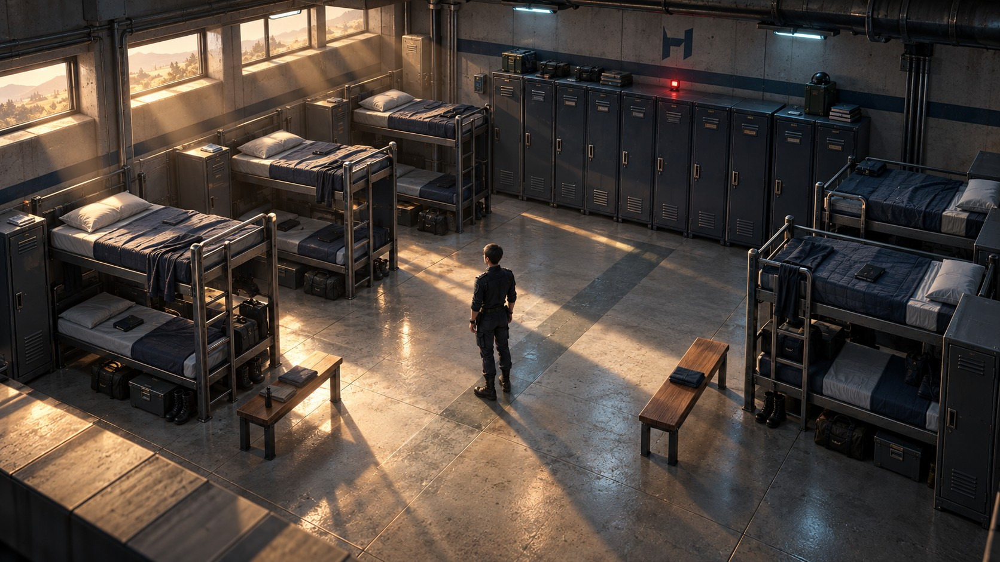
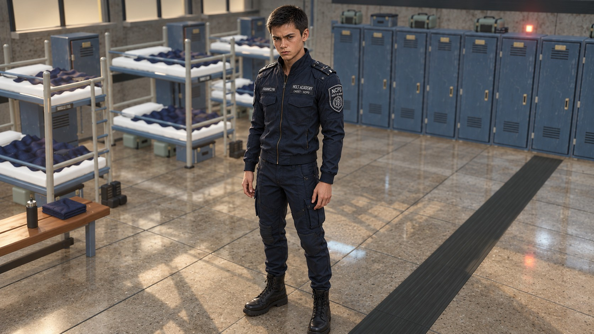

# Dortoir — recherche visuelle dream-loop

30 septembre 2026. Mandat du propriétaire : repartir de l'ambition visuelle, créer un
dortoir d'exploration autonome, et consacrer environ une heure à pousser la fidélité.
Le seuil de fluidité demandé pendant la séance est **30 images/s**. Le rendu du chapitre
n'est pas remplacé par cette étude.

## Ouvrir la scène

`npm run dev`, puis [dormitory-aaa.html](http://localhost:5173/cyberpunk-holt/dormitory-aaa.html).
La même page est une entrée du build Vite. Clic au sol ou ZQSD/WASD/flèches pour marcher,
E pour examiner, Échap pour reprendre, molette pour zoomer, glisser pour cadrer, C pour
recentrer, H pour masquer l'interface. Le bouton Mesures ouvre les compteurs.

## Références et cible

Les références examinées sont l'illustration `art-masters/D01-dortoirs.png`, le brief
`docs/art/image-generation/briefs/D01-dortoirs.md`, le portrait
`docs/art/Reference_pictures/Frankly.png`, et le pilote réel lancé et capturé dans le
navigateur. La revue du pilote précédent signale déjà ses limites de personnage et de
meubles : cette étude vise un saut de composition et de rendu, pas leur généralisation.



**Image de cible générée par imagegen intégré.** Master local :
`.dream-loop/dormitory-aaa/target.png` ; la version JPEG ci-dessus est une conversion
pour la documentation. Les captures du jeu sont identifiées séparément. Boucle Plus,
trois passes de réalisation avec revue navigateur entre les passes. Aucun asset tiers
n'a été téléchargé ; Fal n'était pas configuré. Provenance des matières dans
`public/assets/dormitory-aaa/ATTRIBUTION.md`.

### Prompt de la cible

```text
Use case: stylized-concept. Asset type: exact target gameplay screenshot, 16:9,
1600x900. Generate a genuinely high fidelity AAA quality REAL-TIME 3D GAMEPLAY
SCREENSHOT for an independently rebuilt HOLT police academy dormitory in a cyberpunk
browser role playing game. Input 1 is the current low detail gameplay screenshot to
radically elevate. Input 2 is the established dormitory illustration defining the
institutional architecture, bunk beds, cool steel and concrete. Input 3 defines the
teenage male cadet Franklyn's uniform and identity. This request explicitly permits
redesigning the room and rebuilding the visual demonstration independently. Maintain
an elevated 3/4 exploration camera with moderate perspective, viewing into the room
from its open front right corner, like an immersive cutaway environment in a premium
modern isometric role playing game. Entire detailed room fills the image, no giant
empty aisle. Rectangular room with 6 steel double bunk beds arranged in 3 parallel bays
along left and right, coherent human scale, thin tubular rounded steel frames, true
soft mattresses, blue-gray woven blankets with irregular folds, white pillows. Usable
central aisle, two slim wooden benches, boots and duffel bags below beds, restrained
personal effects, lockers along rear wall with vent louvers, number plates and handles.
Polished but dry concrete floor with subtle seams and markings; pale textured cast
concrete rear and left walls with blue-black painted lower band, horizontal high
windows and dark steel mullions. Morning desert sunlight from upper left produces
broad golden slanting shafts with airborne dust and distinct long shadows; cool teal
indirect light in shadow areas, subtle local cyan fixtures, one restrained red door
status light. Ventilation ducts, conduit cables and structural ribs provide real
architectural scale. One slim teenage Franklyn in navy-black cadet uniform stands mid
foreground in central aisle, naturally scaled, facing away in three quarters. Scene
maintained and orderly but lived in. PBR material fidelity, bevels, contact shadows,
very subtle bloom on small lights only, beautiful broad hierarchy of light and shade,
balanced readable exposure, fine concrete grain, cloth folds, satin steel. Small HOLT
insignia rear wall. No HUD, no UI, no labels overlay, no stylized outlines, no painterly
brush strokes, no miniature toy plastic diorama, no neon pink, no fake cinematic depth
of field. This should be an attainable high quality rendered THREE.JS game scene, not
a photograph or movie shot.
```

### Cible du personnage après revue du propriétaire

Le propriétaire a jugé le décor suffisant pendant la deuxième passe et demandé de
consacrer la suite au personnage et à l'animation. La troisième passe prend donc une
cible rapprochée dérivée de la capture réelle et des deux portraits de Franklyn.



Outil imagegen intégré ; master `.dream-loop/dormitory-aaa/character-target.png`.
Prompt :

```text
Create the exact REAL-TIME 3D GAME CHARACTER INSPECTION SCREENSHOT target for Franklyn
in our cyberpunk academy exploration game. Image 1 is the current running 3D game:
KEEP its dormitory style and materials as background but move the inspection camera
close enough that Franklyn's entire body from head to boots occupies 75% of image
height, front three-quarters, 16:9 frame. Image 2 is the photoreal identity reference,
image 3 the illustrated in-game portrait. Replace ONLY the simplistic current
character with a high-quality realistic animated-game character: SLIM SEVENTEEN YEAR
OLD teenage male, youthful angular face, dark brown short textured hair with untidy
short fringe, light freckled skin, grey hazel eyes, serious reserved expression.
Perfectly reference-matched navy-black NCPD academy tailored zip jacket, upright
collar, shoulder epaulettes, understated small metal reinforcement, grey woven name
tape FRANKLYN and HOLT ACADEMY / CADET NCPD. Tailored dark cargo trousers, black
practical ankle boots, discreet neural port behind left ear. Relaxed natural alert
stance, hands hanging naturally, proper wrists, elbows, youthful narrow shoulders,
thin waist, natural human legs and head proportions. Game-quality PBR skin,
understated freckles and facial features, finely woven matte jacket cloth with seams
and realistic folds at elbows and waist, satin zip and patches. Palette from image 1
lighting. Crisp smooth 3D surfaces, no cartoon outline, no blocky toy geometry, no photo
cutout, no illustration. This is a credible premium modern third-person RPG game model
photographed by an in-game inspection camera with the real dormitory softly present
BEHIND it. No text overlay or HUD. No exaggerated armor, guns, adult superhero muscular
proportions or helmets.
```

## Vérification et mesures

La scène a une API de revue dédiée `window.__dormitoryAAAReview`, distincte de
`window.__game` : `screenPoint(x,z)` projette un point de sol en pixels, `state()` décrit
le mouvement, la marche autorisée et l'observation ouverte, `isWalkable(x,z)` lit les
collisions et `renderer` permet de relever les ressources. Les métriques publiques de
la page sont dans `window.__dormitoryAAA`.

Le navigateur de mesure est Chromium Playwright, **ANGLE D3D11 sur la NVIDIA GeForce
GTX 1070 réelle**, 8 Gio, pilote 560.94. Les arguments `--use-angle=d3d11`,
`--enable-gpu`, `--ignore-gpu-blocklist` évitent le SwiftShader logiciel utilisé par les
anciennes revues. Le pilote précédent, après 240 images en 1920 × 1080, DPR 1 : médiane
et p95 à 16,7 ms ; CPU `renderer.render` médian 1,0 ms, p95 1,4 ms. Ces temps CPU ne
sont pas des temps GPU.

Première passe : les trois observations sont accessibles par de vrais clics ; le
clavier, le changement de qualité, le recentrage et le masquage de l'interface ont été
exercés. Le stockage local est identique avant et après. Deux défauts ont été corrigés :
indices incompatibles lors de la fusion des géométries, et inversion du clavier par
rapport au bas de l'écran. Le comptage du compositeur couvre tous les passages, y
compris les ombres et le post-traitement ; il ne se compare donc pas directement au
compteur de la scène simple du pilote ancien.

Revue finale et mesures après les trois passes : à compléter avant livraison.
