# Tous les lieux d'exploration — revue de la reprise du décor

**Revue corrigée :** [défauts visuels et corrections du 2 octobre](EXPLORATION-AAA-VISUAL-FIXES.md).
Les captures et chiffres ci-dessous documentent la première livraison, avant cette reprise critique.

Revue du 2 octobre 2026. Après les onze pièces et trois circulations HOLT/HOLT-nuit,
la même méthode couvre les **17 zones restantes** : six au centre d'examen, dix dans
les souterrains et le campement. Le hangar HOLT, après l'examen écrit, reçoit aussi
une reprise ciblée. [Plan E0–E13](../process/EXPLORATION-AAA-ROLLOUT-PLAN.md),
[ADR 0038](../process/adr/0038-profils-decor-toutes-explorations.md).

## Résultat

Les cinq cartes d'exploration utilisent désormais le même registre de profils,
les matières du pilote, la perspective plongeante et les portes thématiques.
Le centre conserve son béton usé et son éclairage froid : fourgon d'arrivée,
bancs et rangement du hall, équipement K9/secours, réserve blindée et console
métallique de la salle 3. La cour conserve exactement la topologie tactique ;
ses containers et caisses reçoivent des détails dans la même emprise, réemployés
dans YardView au passage en combat.

Les conduits gardent leurs sept tronçons, le labo cyan, le dortoir et la cantine.
Les tuyaux, gaines et appliques restent sur les parois. L'ouverture réelle du
ventilateur retire les pales et conserve le cadre, sans ajouter d'interaction.
Les grandes lames opaques du feu deviennent des flammes translucides animées.
Le campement reçoit un camion détaillé, des tentes rapiécées et le contraste entre
lune et feu. Le hangar ajoute rails, montants, câbles, fixations et longues
appliques murales, avec vitrages et détails des fourgons.

Les raccords en L/T rognent désormais les extrémités des panneaux et de leurs
chaperons contre le mur perpendiculaire. Les accessoires suivent la coupe
réelle de leur groupe, sans coupe propagée aux murs voisins. Le dernier cube
ancien au coin nord-est du dortoir est supprimé : les deux façades du pilote
possèdent déjà ce raccord. Tous les murs de structure sont habillés.

Les hauteurs apparaissent finies au démarrage : 4,9 m pour les façades du centre,
2,45 m pour ses cloisons et les murs des souterrains/campement. Une coupe liée à
l'occultation du meneur reste possible. Sols et mobilier suivent la découverte.
Le centre, la cour et le campement restent mats ; trois petits miroirs des
souterrains et celui du hangar réemploient un seul Reflector par vue. Il décroît
au dézoom et disparaît à 34. Les noms restent dans le HUD de survol/appui.

La production réemploie les références, textures et éléments procéduraux du pilote,
avec des agents GPT-6 Luna. Aucun nouveau bitmap n'était nécessaire. Les modèles
et animations des personnages sont le chantier séparé du propriétaire.

## Captures finales

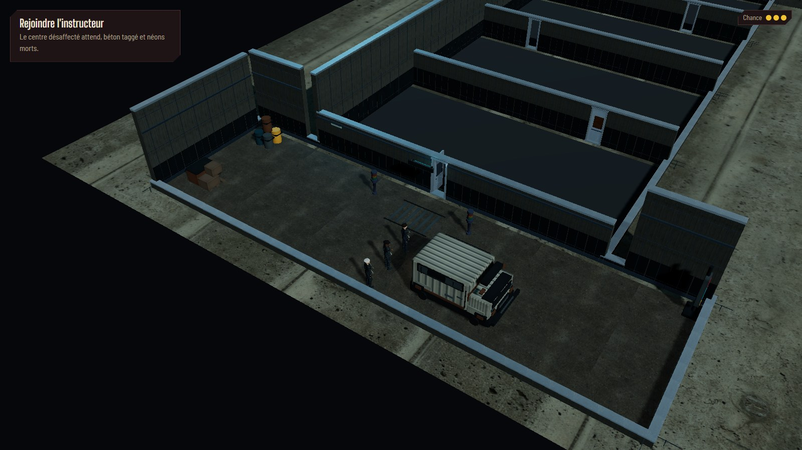

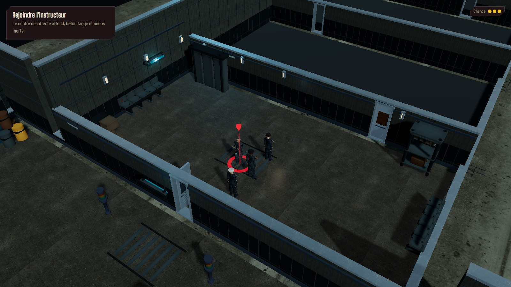

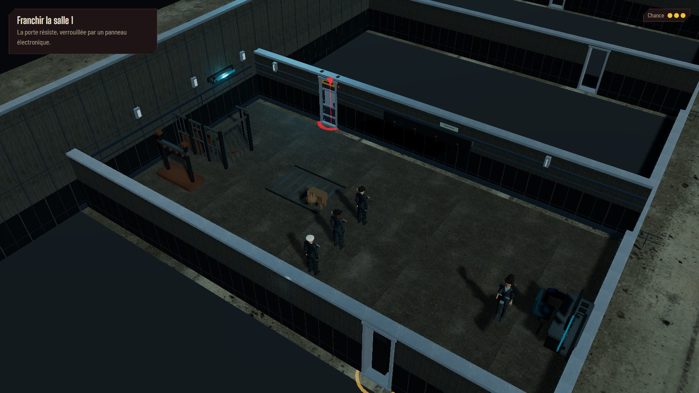

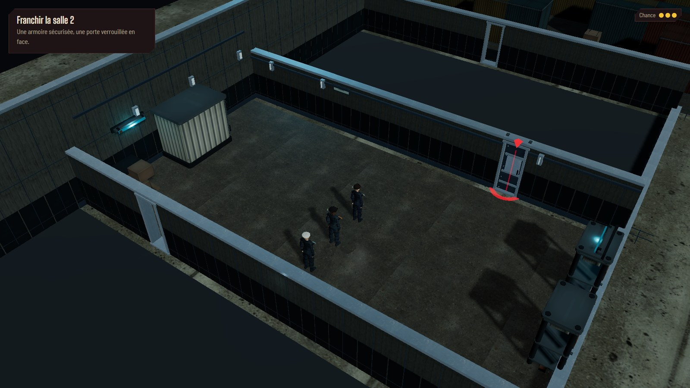

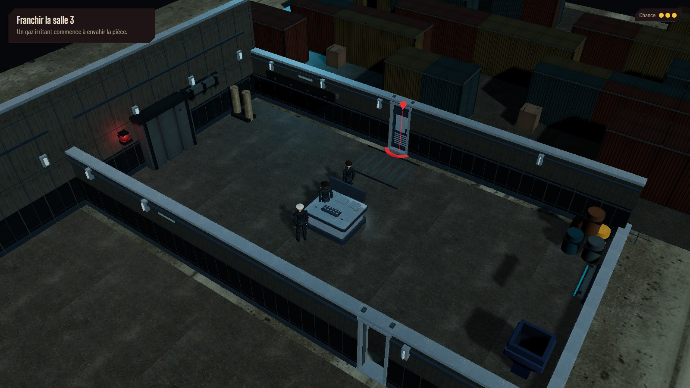

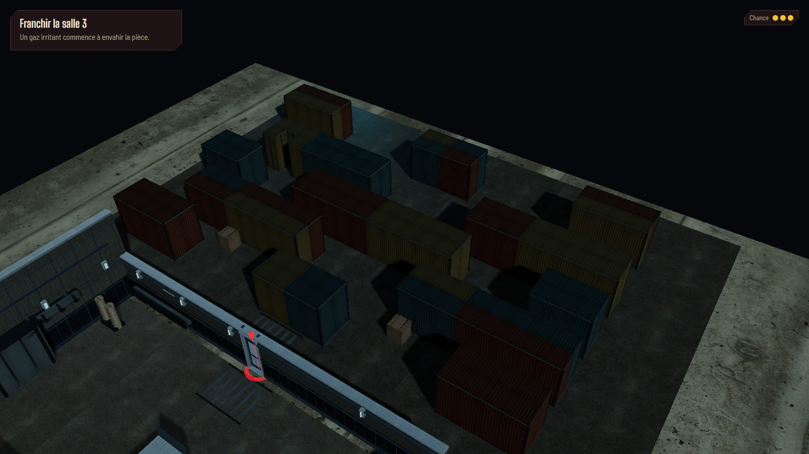

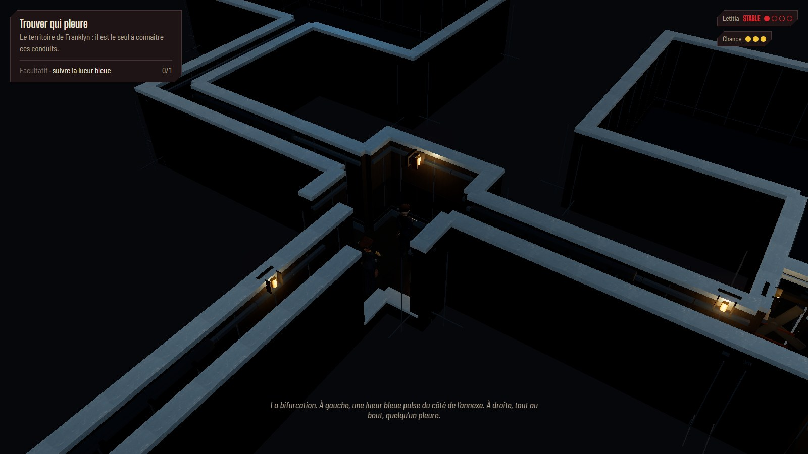

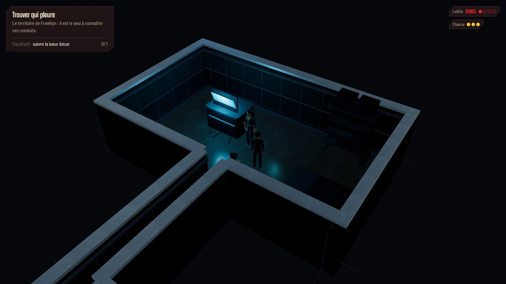

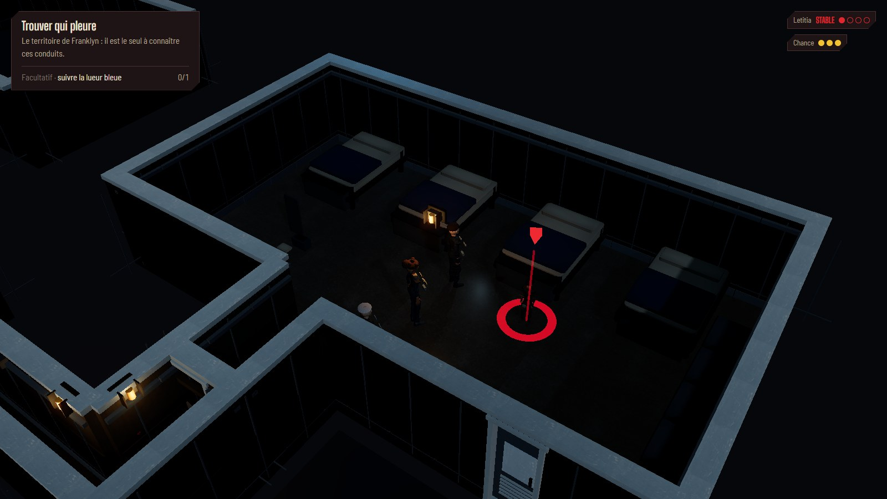

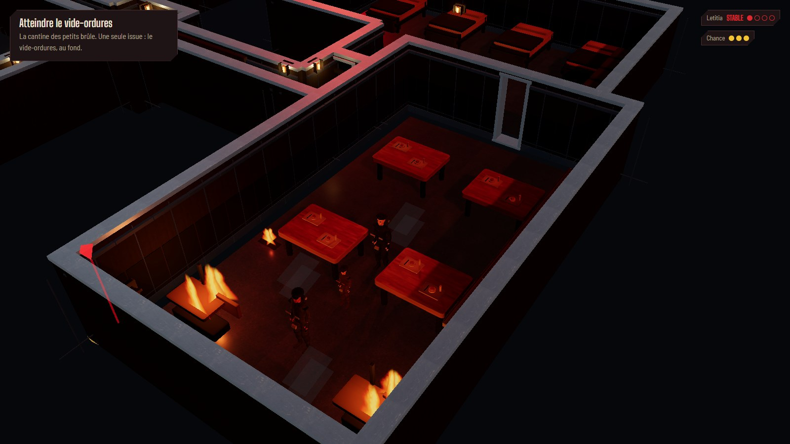

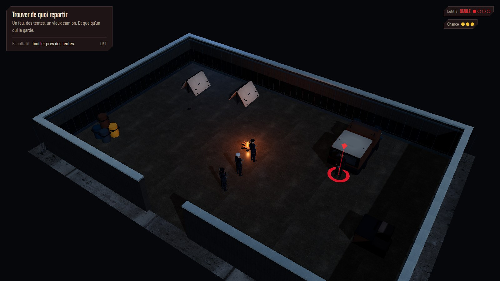

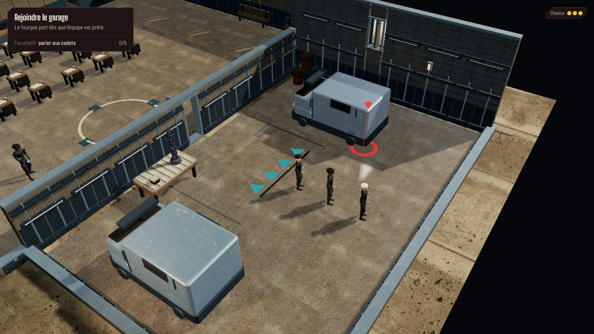

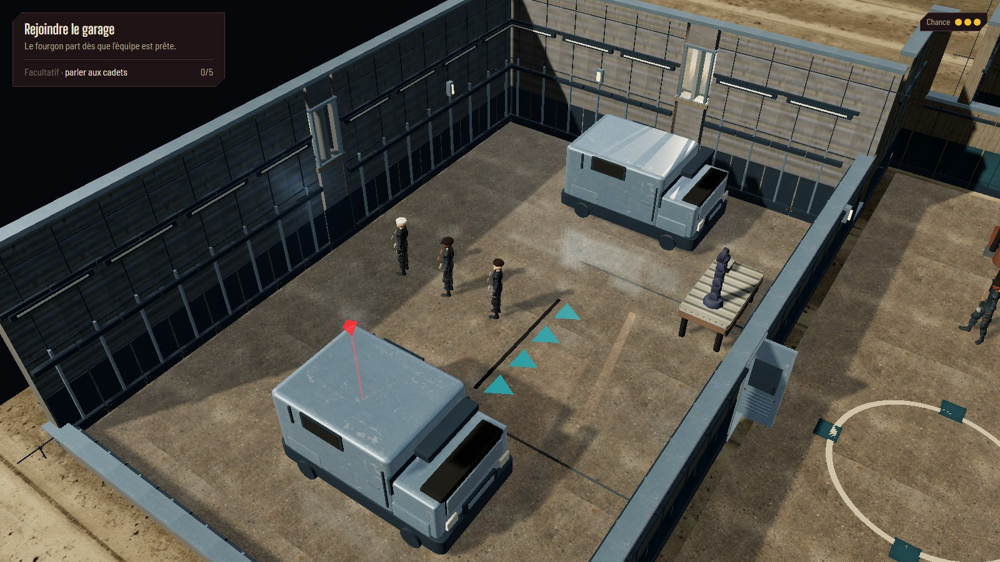

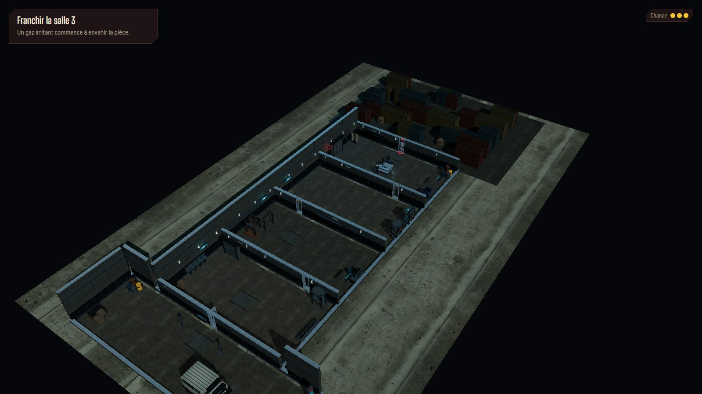

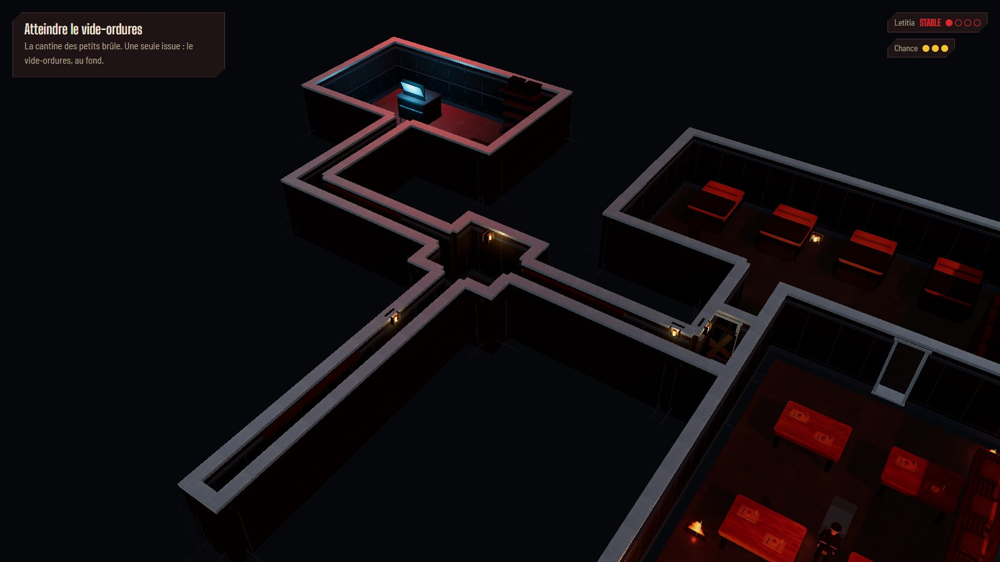

Une manche finale couvre les douze vues décisives, avec angles opposés de la salle 3,
de la cantine, du campement et du hangar, puis deux vues larges des cartes. Les captures
avec découverte complète servent à juger le coût cumulé et les raccords ; elles
ne changent pas la découverte en jeu.

## Performances

Chromium, ANGLE D3D11, GTX 1070, 1920 × 1080, DPR 1, personnages présents.
Relevés successifs sans build ni navigateur de test concurrent : 45 images
d'échauffement, puis 180 intervalles requestAnimationFrame. Toutes les pièces
de chaque carte sont découvertes. Les appels incluent ombres, miroir et composition.

| Cadrage                                       |     p50 |     p95 |     p99 | Appels | Triangles |
| --------------------------------------------- | ------: | ------: | ------: | -----: | --------: |
| Salle de contrôle, centre découvert           | 16,7 ms | 16,7 ms | 16,8 ms |    943 |   862 510 |
| Centre, vue large et découverte complète      | 16,7 ms | 16,8 ms | 16,8 ms |  1 145 | 1 020 198 |
| Cantine en feu, souterrains découverts        | 16,7 ms | 16,8 ms | 33,4 ms |  1 625 |   650 904 |
| Souterrains, vue large et découverte complète | 16,7 ms | 16,8 ms | 33,4 ms |  1 666 |   650 940 |
| Campement, deux suiveurs présents             | 16,7 ms | 16,7 ms | 16,8 ms |    388 |   220 960 |
| Hangar, école entièrement découverte          | 16,7 ms | 33,4 ms | 33,4 ms |  2 074 | 2 965 714 |

Ces relevés courts soutiennent la cible d'environ 30 ips demandée, y compris
avec le miroir du hangar actif et toute l'école découverte. Ils ne promettent
pas une cadence constante pendant toute une partie, et ne couvrent pas DPR 1,5
sur ces nouvelles cartes. Les chiffres incluent les assets de personnages présents
dans le workspace au moment de la mesure ; leurs compressions sont un travail
concurrent du propriétaire.

## Vérification

- npm run verify passe : **770 tests dans 55 fichiers**, typage, lint et build.
  Les nouveaux tests gardent couverture des profils, découverte, hauteurs,
  raccords L/T, emprises des détails tactiques, poses murales et porte du ventilateur.
- Audit navigateur : **18 visites** (17 zones et hangar), perspective et profil
  actif corrects, aucune cellule de mur de structure hors enveloppe, miroir
  désactivé en vue large et ouverture réelle des pales vérifiée.
- Trois cycles centre → conduits → campement → HOLT : **126 → 124 géométries**
  et **70 → 70 textures** aux deux derniers relevés. La revue statique des
  propriétaires de ressources ne relève pas de fuite. Le premier relevé varie
  pendant les chargements asynchrones ; les comptes ne sont pas un stress test.
- Redimensionnement 1280 × 720 contrôlé ; aucune erreur de page ou de console
  pendant cet audit et les captures finales.
- **Neuf parcours e2e passent** : huit contrôles exploration/chapitre 2,
  puis le parcours narratif du chapitre 1 incluant toutes les salles du centre,
  le portail de la cour, le combat et son procès-verbal. Clics réels, portes
  et reprise de partie sont également couverts.

## Rejouer

Démarrer npm run dev, puis ouvrir :

- [Centre d'examen](http://localhost:5173/cyberpunk-holt/?scene=ch1.centre-hall&seed=exploration-aaa).
- [Souterrains](http://localhost:5173/cyberpunk-holt/?scene=ch2.conduits&seed=exploration-aaa).
- [Cantine en feu](http://localhost:5173/cyberpunk-holt/?scene=ch2.cantine&seed=exploration-aaa).
- [Campement](http://localhost:5173/cyberpunk-holt/?scene=ch2.campement&seed=exploration-aaa).
- [HOLT au temps libre, rejoindre le garage](http://localhost:5173/cyberpunk-holt/?scene=ch1.hub&seed=exploration-aaa).

A/E tournent la caméra, la molette règle le zoom et C recentre sur Franklyn.
