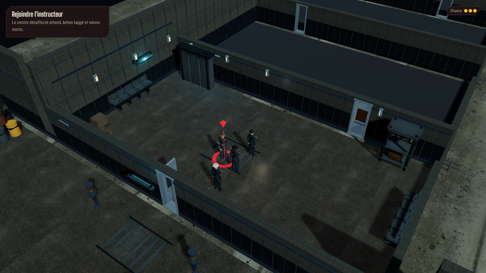
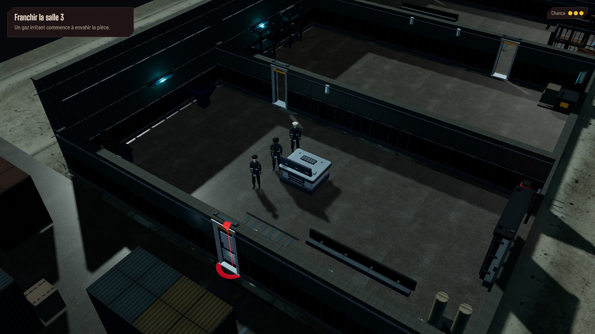
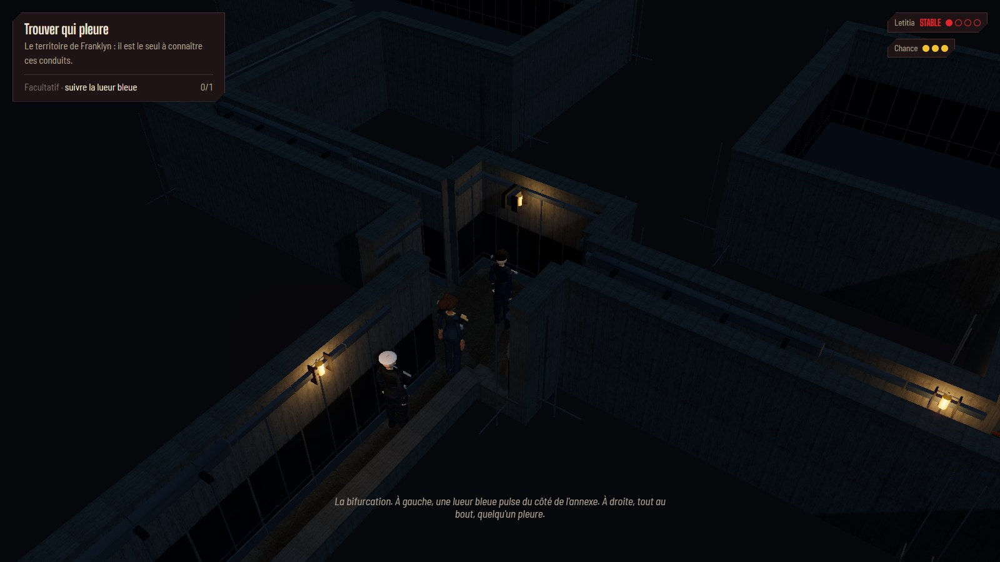
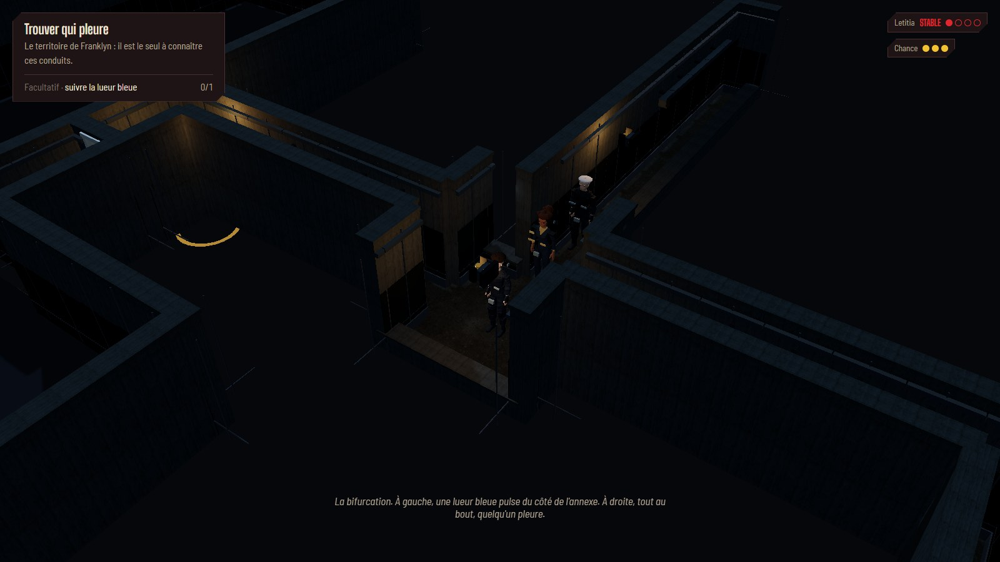
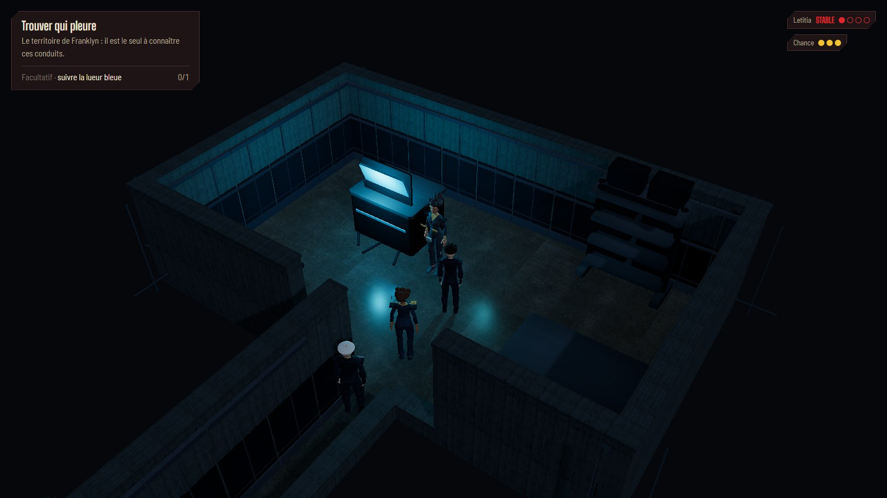
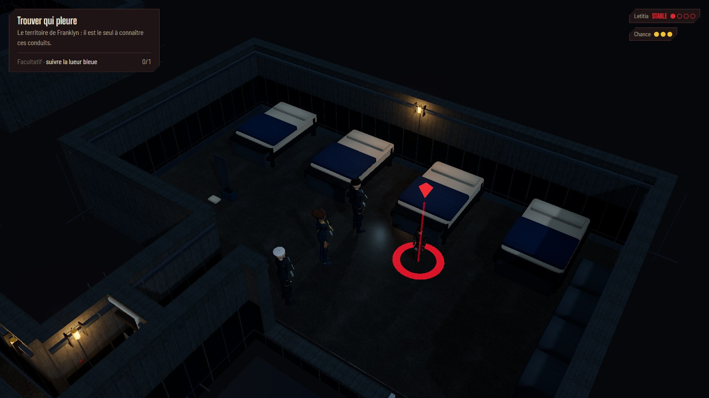
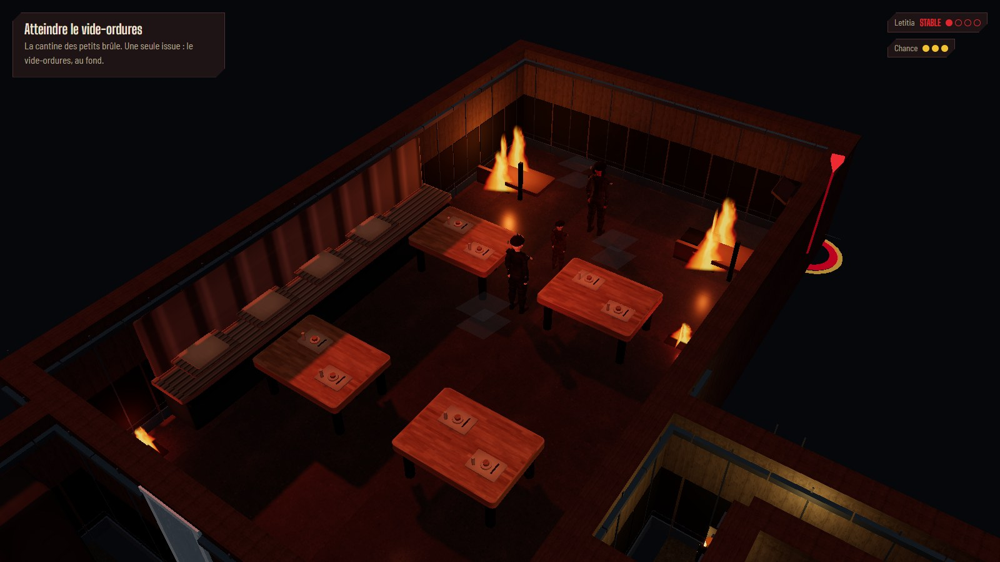
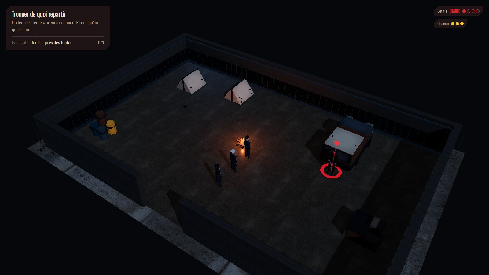
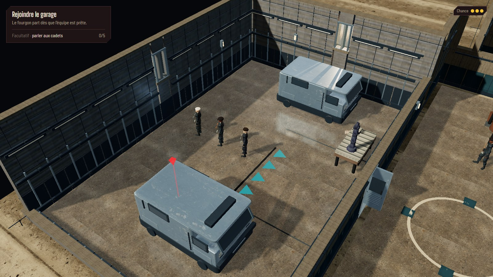
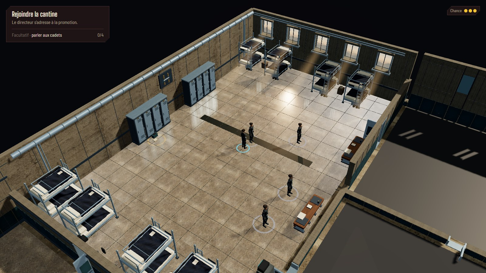

# Exploration — corrections après revue des images

> Revue historique. Les règles de coupe ci-dessous sont remplacées par l’[ADR 0039](../process/adr/0039-murs-exploration-entiers.md).
> Voir la [reprise actuelle, murs fixes et 39 pièces relues](EXPLORATION-STATIC-WALLS-REVIEW.md).

Reprise du 2 octobre 2026, avec trois agents GPT-6 Luna et revue des captures par l’orchestrateur.
La [première livraison](EXPLORATION-AAA-ROLLOUT-REVIEW.md) passait les contrôles techniques,
mais ses images montraient encore des défauts de lisibilité et de finition.

## Défauts corrigés

- Les gros chaperons métalliques clairs dominaient les murs. Ils font désormais 5 cm en coupe,
  7 cm en hauteur complète, avec une finition mate issue du béton du mur. Les linteaux s’adaptent
  à la hauteur réelle des cloisons ; les vantaux conservent leur état de jeu.
- Un rayon vers le torse de Franklyn laissait ses jambes et les suiveurs masqués. Trois rayons
  par membre visible couvrent le bas du corps et les épaules. Les allèges et montants des fenêtres
  participent au calcul, leurs véritables ouvertures restant libres. Les coupes suivent la file
  dans les quatre orientations et restent indépendantes de la découverte des pièces.
- Les conduits avaient des sols et parois presque noirs. Leurs teintes et leur lumière de
  remplissage sont relevées ; les appliques chaudes et la machine cyan gardent leur rôle de repères.
  La cantine reçoit un remplissage plus neutre, et le campement un peu plus de lumière froide.
- Deux placements suspendus hérités, réglette et gaine, flottaient dans le dortoir pilote.
  Ils sont retirés avec leurs anciens modèles inutilisés. La veilleuse des petits rejoint le mur
  nord, à 2,22 m ; sa classification murale fait contrôler cet ancrage par le test global des placements.
- Les pare-brise étaient partiellement enfouis dans le nez des fourgons. La cabine a maintenant
  un toit continu, un avant abaissé et un vitrage visible, lisse, fumé et réfléchissant. Le camion
  du campement reçoit aussi une cabine plus lisible. Les tentes ont leurs pignons fermés et leurs
  pièces de réparation suivent la pente de la toile.

La factory possède le matériau de vitrage partagé par les véhicules. Elle reçoit le PMREM via
le décor et libère son matériau au changement de carte ; elle emprunte la texture d’environnement.
Les vitres de l’architecture reçoivent également cet environnement avec un gain limité à 0,12.
Le béton, la peinture et les chaperons conservent leur éclairage mat : appliquer le PMREM
à tous leurs clones blanchissait les parois nocturnes. Un test de propriété vérifie ce choix
et la libération des matériaux sans libérer la texture empruntée.
Ces corrections ne déplacent aucun obstacle, aucune entité ou porte. Les personnages et animations
restent le chantier séparé du propriétaire. [Décision et propriété des ressources](../process/adr/0038-profils-decor-toutes-explorations.md).

## Captures relues

Les vues rapprochées servent à vérifier les matières et les occultations. Les téléportations
utilisées pour les captures choisissent des positions franchissables pour la file, afin d’éviter
les suiveurs dans un meuble causés par le placement synthétique de l’outil de debug.

Comparaisons avec la première livraison : [conduits](reviews/remaining-rollout/final-bifurcation-q0.jpg),
[labo](reviews/remaining-rollout/final-labo-q0.jpg), [hangar](reviews/remaining-rollout/final-garage-q1.jpg).
Les ambiances nocturnes restent sombres ; cette revue vise des surfaces et une circulation lisibles,
pas une équivalence artistique garantie avec chaque image de référence.

## Coût mesuré

Chromium, ANGLE D3D11, GTX 1070, 1920 × 1080, DPR 1. Mesures successives sans build ou navigateur
concurrent : 45 images d’échauffement puis 180 intervalles requestAnimationFrame. Les pièces des cartes
sont toutes découvertes ; les personnages du workspace sont présents. Les appels incluent ombres,
miroir et composition. Cantine et hangar sont remesurés après les dernières corrections ;
centre et campement conservent les relevés des surfaces mates inchangées.

| Vue                             |     p50 |     p95 |     p99 | Appels | Triangles |
| ------------------------------- | ------: | ------: | ------: | -----: | --------: |
| Centre, salle de contrôle       | 16,7 ms | 16,8 ms | 16,8 ms |    947 |   868 366 |
| Cantine, souterrains découverts | 16,7 ms | 33,3 ms | 33,4 ms |  1 616 |   662 520 |
| Campement                       | 16,7 ms | 16,8 ms | 16,8 ms |    397 |   227 452 |
| Hangar, école découverte        | 16,7 ms | 33,4 ms | 50,0 ms |  2 120 | 3 019 810 |

Sur ces relevés courts, 95 % des intervalles restent autour de 33,4 ms ou moins, soit environ
30 ips. Le hangar présente quelques pointes à 50 ms ; il reste la vue la plus coûteuse.
Ces relevés ne mesurent pas une partie entière ni les autres matériels. Les fichiers de personnages
chargés incluent les compressions réalisées séparément par le propriétaire.

## Vérification

- `npm run verify` passe : typage, lint, **773 tests dans 55 fichiers**, build.
  Trois régressions supplémentaires couvrent jambes masquées, suiveur occulté et véritable ouverture de fenêtre.
- **Neuf parcours e2e passent** : déplacements et clics réels, portes, chapitre 1 jusqu’au
  procès-verbal et parcours du chapitre 2. Le dernier réglage des vitres, sans changement
  de gameplay, est contrôlé par le build, les tests unitaires et les captures finales.
- **Audit des 18 zones réussi** : toutes les cellules de mur ont leur habillage, perspective et
  profils actifs, miroir désactivé au grand dézoom, pales masquées après ouverture réelle
  du ventilateur, redimensionnement à 1280 × 720 sans erreur de console.
- **Six cycles de transitions contrôlés** : après normalisation du cadrage, découverte de
  toutes les pièces et échauffement des quatre orientations, le compteur se stabilise
  à **319 géométries / 135 textures** dès le deuxième cycle et sur les cinq derniers cycles.
  Le suivi des géométries envoyées au GPU ne trouve aucune ressource survivante sans
  propriétaire dans la vue courante. Le compteur pris avant normalisation variait selon
  les fenêtres, sols et détails visibles ; il ne permettait pas une comparaison stricte.

## Essayer

- [Dortoir](http://localhost:5173/cyberpunk-holt/?scene=ch1.vers-cantine&seed=visual-fixes).
- [Centre d’examen](http://localhost:5173/cyberpunk-holt/?scene=ch1.centre-hall&seed=visual-fixes).
- [Conduits](http://localhost:5173/cyberpunk-holt/?scene=ch2.conduits&seed=visual-fixes).
- [Cantine](http://localhost:5173/cyberpunk-holt/?scene=ch2.cantine&seed=visual-fixes).
- [Campement](http://localhost:5173/cyberpunk-holt/?scene=ch2.campement&seed=visual-fixes).
- [Hangar, pendant le temps libre](http://localhost:5173/cyberpunk-holt/?scene=ch1.hub&seed=visual-fixes).

A/E tournent la caméra ; C recentre sur Franklyn ; la molette règle le zoom.
