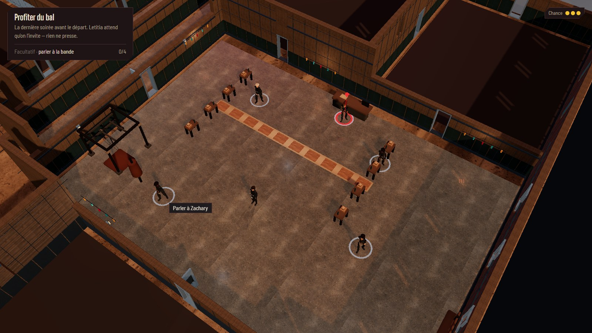
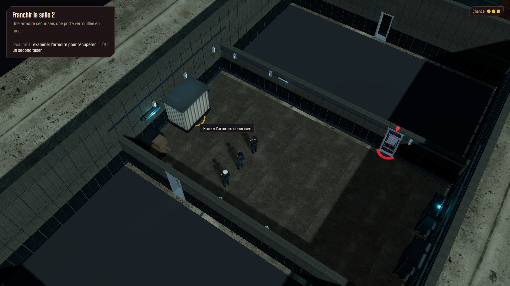
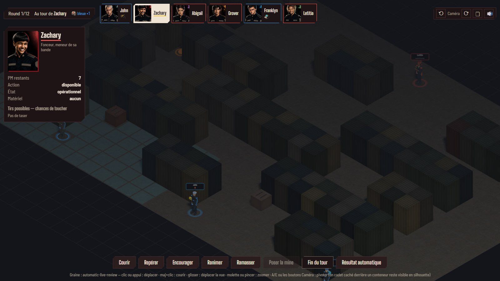

# Interactions après la refonte du décor — 3 octobre 2026

Les anneaux des PNJ et objets étaient à 0,015 m, sous les nouveaux sols à 0,025 m
et leurs joints à 0,035 m. Ils sont maintenant à 0,05 m, avec le même rayon de saisie.
La découverte des pièces et les conditions d'étape continuent de piloter leur visibilité.

Au bal, les cinq cadets sont visibles, leurs modèles sont chargés et leurs anneaux
apparaissent. Zachary est toujours en (32,46) ; le survol l'identifie et un vrai clic ouvre
sa conversation. Aucune modification du modèle de personnage n'a été nécessaire.

Le cercle de fouille devant les tentes apparaît et un vrai clic ouvre le beat des insignes.
L'armoire sécurisée de la salle 2 apparaît aussi comme détour facultatif dans l'objectif.
Son propre beat propose le jet donnant le second taser ; il rend la main à l'exploration.
La porte nord garde son verrou et son dialogue séparés. La réussite seule accorde le taser ;
forcer coûte deux points de tempo, ignorer ne coûte rien.

Le bouton **Résultat automatique**, en bas du HUD tactique, fait jouer les deux équipes
par l'IA seedée depuis le combat en cours. Revue avec un tour adverse et une animation
en attente : la progression est conservée, le timer et les animations sont arrêtés,
le combat se termine, la note est enregistrée et le bilan reste stable ensuite.

Validation : `npm run verify` passe, avec 778 tests unitaires. Les tests de l'armoire
couvrent la réussite, l'échec et l'abandon ; ceux de l'IA couvrent la résolution seedée,
la conservation de l'état et sa borne. Les clics de Zachary, des tentes et de l'armoire
ont été vérifiés dans le navigateur sans erreur console.
Les neuf parcours navigateur ciblés passent aussi, dont les chapitres complets,
la reprise de la salle 2 et le bouton automatique menant au bilan puis au chapitre 2.
