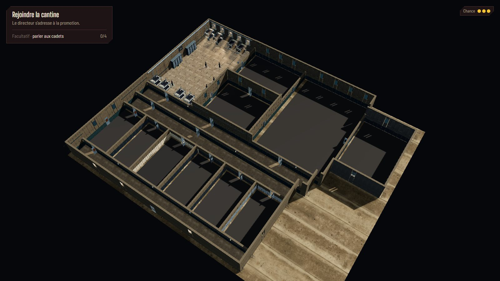
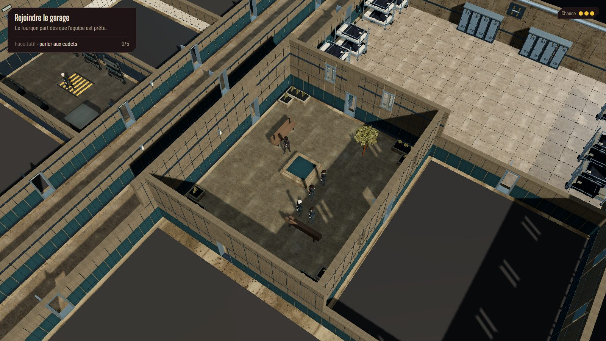
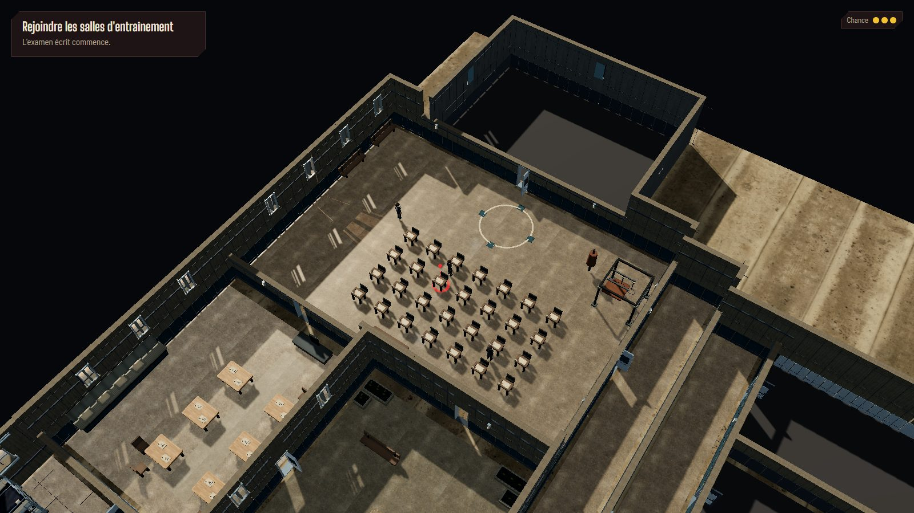
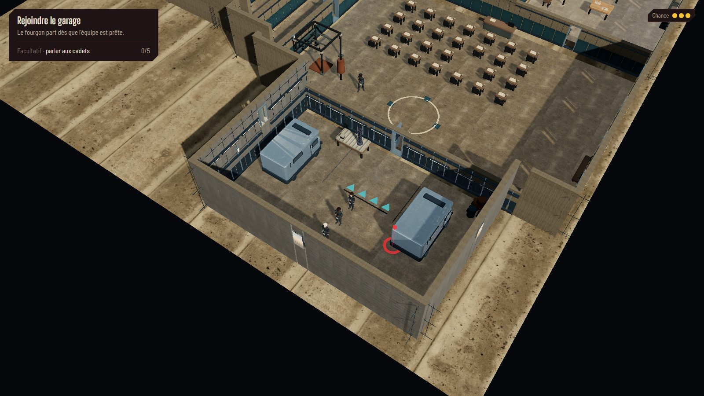
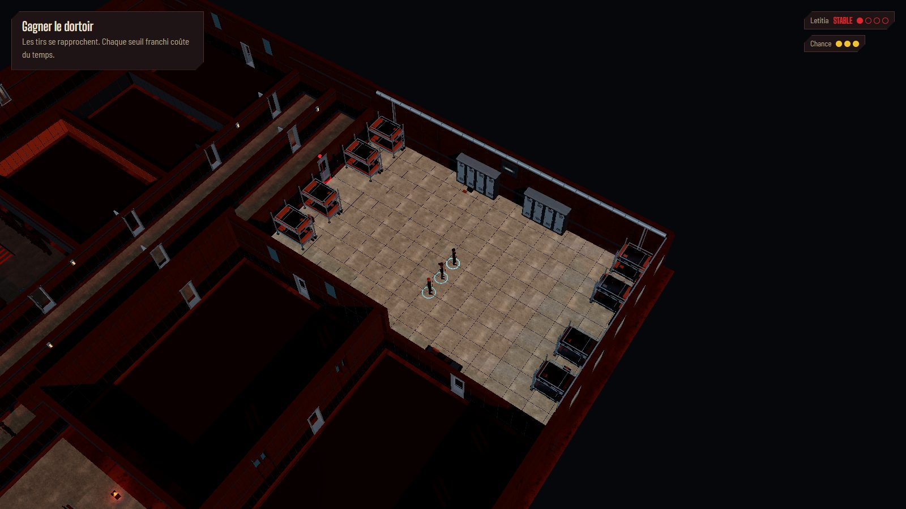
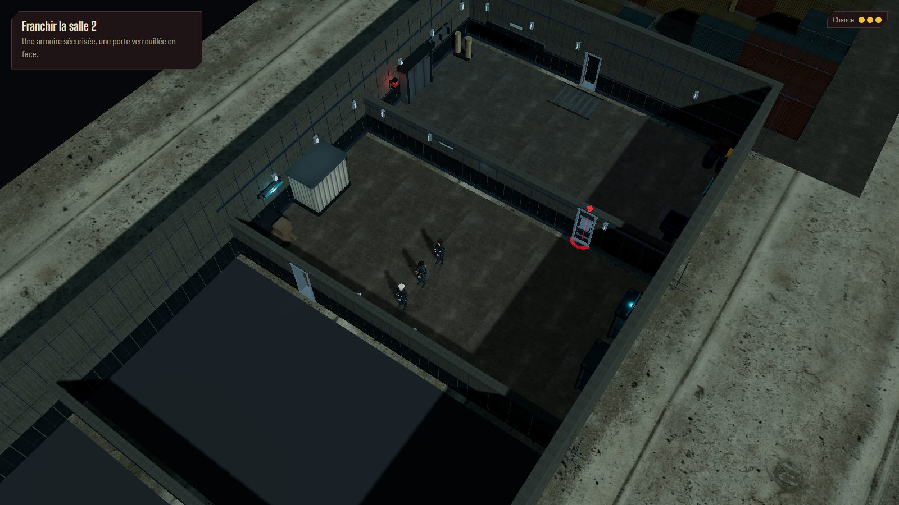
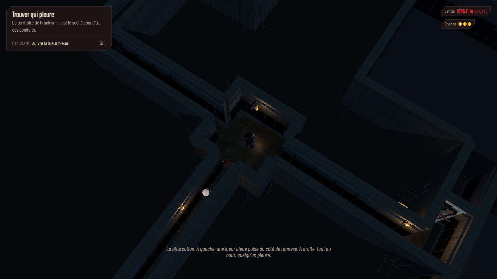
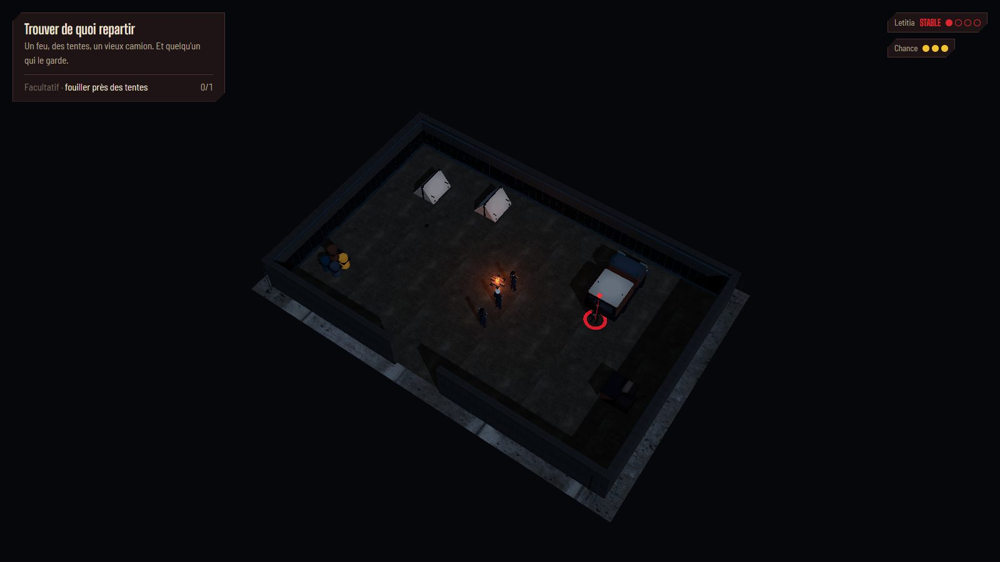

# Exploration — murs fixes et revue pièce par pièce

Reprise du 2 octobre 2026 avec trois agents GPT-6 Luna et relecture des images par l’orchestrateur.
La priorité est une architecture cohérente dès l’arrivée : aucun mur ne s’efface ou ne change de
hauteur quand Franklyn entre dans une pièce, se déplace ou tourne la caméra.
[Décision actuelle : ADR 0039](../process/adr/0039-murs-exploration-entiers.md).

## Corrections

- Façades, pourtour de la cour intérieure et hangar : **4,9 m**, y compris les pans sans fenêtre.
  Cloisons intérieures : **2,45 m**. Les souterrains et le campement restent à 2,45 m.
- Les deux rangées ASCII entre cantine et salle d’examen représentent maintenant **un seul mur
  physique**, avec les finitions de chaque pièce sur sa face respective. Les cases de collision
  et identifiants des portes restent ceux de la carte. Le coin cour–cantine–examen rejoint le
  même plan, sans jour entre les segments. Les murs distincts du ventilateur des conduits
  gardent leurs plans séparés ; la fusion des doubles rangées ne concerne que HOLT/HOLT-nuit.
- Tous les calculs de coupe automatique sont désactivés, dans les quatre orientations et sur
  les cinq cartes. Façades du pilote, murs de couloir et accessoires muraux suivent cette règle.
- Le contenu d’une salle inconnue reste masqué : sol uniforme sans texture, mobilier, détails
  de pièce et entités non révélés avant l’entrée. L’enveloppe conserve sa hauteur et sa finition.
- Caméra à environ **55° vers le bas** ; **70° dans les conduits**, dont les passages ne font
  qu’une case de large. Projection, déplacement et pointeur utilisent la même caméra.
- La bande sombre de l’ancienne allée du dortoir est supprimée : le béton reste continu.
  Les hachures de l’armurerie et les chevrons du hangar deviennent des peintures mates,
  sans émission lumineuse ; les écrans et appliques gardent leur éclairage.
- Le remplissage froid existant est relevé dans les ombres du centre, des conduits et du
  campement. Aucun luminaire ou calcul d’ombre supplémentaire n’est ajouté.

## Méthode de contrôle

Deux passes complètes sur **39 pièces et zones**, chacune sous deux angles opposés : HOLT
et sa version nocturne comptent séparément. La seconde cadre les murs et utilise l’étape
narrative propre à chaque salle : `ch1.vers-examen` pour l’examen écrit, `ch1.hub` pour le
hangar, les trois scènes de salles pratiques, `ch2.bal` ou `ch2.fuite`, puis les scènes des
conduits, de la cantine et du campement. Une dernière passe examine les lieux corrigés dans
les quatre orientations.

Avant les visites, une partie neuve sur chacune des cinq cartes vérifie les salles inconnues :
aucune texture de sol ni aucun mobilier ou profil de pièce prématurément visible. Pendant les
visites, le contrôle exige zéro groupe de mur en coupe. Les captures utilisent le déplacement
instantané de debug ; les tests de parcours exercent ensuite les interactions réelles.

## Revue des salles

| Lieu                          | Pièces relues       | Contrôle visuel et résultat                                                                  |
| ----------------------------- | ------------------- | -------------------------------------------------------------------------------------------- |
| HOLT / administration         | Jour et fuite       | Baies extérieures hautes, porte nord distincte, bureau et seuil dégagés.                     |
| HOLT / interface              | Jour et fuite       | Consoles latérales, cloison basse vers l’infirmerie, aucun élément suspendu.                 |
| HOLT / infirmerie             | Jour et fuite       | Lits et chariots lisibles, angles fermés, portes alignées aux cloisons.                      |
| HOLT / armurerie              | Jour et fuite       | Racks latéraux, centre libre ; hachures corrigées en peinture mate.                          |
| HOLT / archives               | Jour et fuite       | Rayonnages et caisses rangés contre les murs, seuil sans raccord ouvert.                     |
| HOLT / local technique        | Jour et fuite       | Baie sud haute, transformateur et atelier visibles, circulation intacte.                     |
| HOLT / dortoirs               | Jour et fuite       | Façades du pilote entières, lits et casiers ; ancienne bande d’allée retirée.                |
| HOLT / cour intérieure        | Jour et fuite       | Quatre côtés hauts, baies et passages conservés, raccord sud continu.                        |
| HOLT / cantine                | Jour et fuite       | Tables, comptoir et portes ; séparation avec l’examen unique et basse.                       |
| HOLT / entraînement           | Examen écrit et bal | Cloison de cantine à 2,45 m, façade de cour à 4,9 m ; bureaux ou piste selon l’étape.        |
| HOLT / garage                 | Jour et fuite       | Façades à 4,9 m, séparation avec entraînement basse, deux fourgons et allée lisibles.        |
| Centre / parking              | Arrivée             | Fourgon et entrée encadrés par des murs hauts ; ombres lisibles.                             |
| Centre / hall                 | Briefing            | Bancs, cage et instructeur, axe de circulation ouvert.                                       |
| Centre / salle 1              | Étape salle 1       | Agrès K9 et équipement visibles ; passages et angles continus.                               |
| Centre / salle 2              | Étape salle 2       | Armoire active et cages lisibles ; ombres relevées, seuil nord intact.                       |
| Centre / salle 3              | Étape salle 3       | Console active, filtration et gaz ; façade vers la cour vérifiée.                            |
| Centre / cour                 | Étape salle 3       | Containers et emprises tactiques conservés ; aucun nouveau volume.                           |
| Conduits / bouche             | Conduits            | Parois fixes, passage vertical et appliques latérales ; vue à 70°.                           |
| Conduits / bifurcation        | Conduits            | Jonctions techniques et directions lisibles, lumière chaude localisée.                       |
| Conduits / annexe             | Conduits            | Branche horizontale relue dans les deux sens, continuité des parois.                         |
| Conduits / annexe nord        | Conduits            | Passage étroit vertical, sol mieux lisible dans l’ombre.                                     |
| Conduits / passage des petits | Conduits            | Liaison horizontale sans coupe de mur ; parois continues.                                    |
| Conduits / ventilateur        | Conduits            | Cadre et pales fermées lisibles ; fermeture liée à l’état réel de la porte.                  |
| Conduits / pales              | Conduits            | Seuil et sortie vers le dortoir ; aucun plafond masquant.                                    |
| Conduits / labo               | Conduits            | Machine cyan comme repère, reflet local limité, équipements latéraux.                        |
| Conduits / petits             | Conduits            | Lits, casiers, veilleuse fixée au mur ; parcours dégagé.                                     |
| Conduits / cantine            | Cantine             | Tables et feux visibles, trappe active, sol chaud sans miroir global.                        |
| Campement                     | Campement           | Deux tentes, camion, caisses et brèche visibles ; feu chaud et ombres froides mieux séparés. |

## Captures finales

Les planches de la seconde passe couvrent toutes les pièces :

- [HOLT : administration, interface, infirmerie](reviews/static-walls/pass2-holt-sheet0.jpg)
- [HOLT : armurerie, archives, atelier](reviews/static-walls/pass2-holt-sheet1.jpg)
- [HOLT : dortoir, cour, cantine](reviews/static-walls/pass2-holt-sheet2.jpg)
- [HOLT : examen et hangar](reviews/static-walls/pass2-holt-sheet3.jpg)
- [Centre : cour, salles 3 et 2](reviews/static-walls/pass2-centre-examen-sheet0.jpg)
- [Centre : salle 1, hall et parking](reviews/static-walls/pass2-centre-examen-sheet1.jpg)
- [Nuit : administration, interface, infirmerie](reviews/static-walls/pass2-holt-nuit-sheet0.jpg)
- [Nuit : armurerie, archives, atelier](reviews/static-walls/pass2-holt-nuit-sheet1.jpg)
- [Nuit : dortoir, cour, cantine](reviews/static-walls/pass2-holt-nuit-sheet2.jpg)
- [Nuit : bal et hangar](reviews/static-walls/pass2-holt-nuit-sheet3.jpg)
- [Conduits : bouche, bifurcation, annexe](reviews/static-walls/pass2-conduits-sheet0.jpg)
- [Conduits : annexe nord et passages](reviews/static-walls/pass2-conduits-sheet1.jpg)
- [Conduits : pales, labo, petits](reviews/static-walls/pass2-conduits-sheet2.jpg)
- [Conduits : cantine](reviews/static-walls/pass2-conduits-sheet3.jpg)

La dernière passe ci-dessous inclut les corrections de finition et d’éclairage :

## Validation

- `npm run verify` : typage, lint, **771 tests dans 54 fichiers** et build réussis.
  Les assertions globales couvrent la continuité des plans et des raccords en L/T,
  les hauteurs de cour, la cloison unique et l’absence de coupe lors des rotations/entrées.
- **Neuf parcours e2e réussis** : chapitres 1 et 2, clics réels sur objets et portes,
  franchissement et reprise après ouverture de l’armoire, reprise d’une étape sauvegardée.
- **39 pièces, deux passes de 78 vues**, puis **24 zones revues sur 96 vues finales**.
  Zéro erreur de console et zéro groupe de mur en coupe sur ces contrôles.
  Les caméras mesurées donnent 55,16° et 70°.
- Audit de 18 zones : habillage des cellules, profil/perspective, miroir désactivé au grand
  dézoom, disparition des pales après ouverture réelle, redimensionnement sans erreur.
- Six cycles de transitions : après échauffement, **319 géométries et 137 textures** stables
  sur les cinq derniers cycles. Aucun objet géométrique GPU survivant sans propriétaire.

Mesures à **1920 × 1080, DPR 1, GTX 1070, ANGLE D3D11**, avec captures, audit et tests exécutés successivement :
45 images d’échauffement puis 180 intervalles. Murs entiers ; découverte complète pour
le dortoir, le hangar et les souterrains de la cantine.

| Vue                             |     p50 |     p95 |     p99 | Appels | Triangles |
| ------------------------------- | ------: | ------: | ------: | -----: | --------: |
| Dortoir, école découverte       | 33,3 ms | 33,4 ms | 33,4 ms |  3 274 | 4 439 886 |
| Hangar, école découverte        | 16,7 ms | 33,4 ms | 33,4 ms |  2 018 | 2 120 818 |
| Centre, salle 3                 | 16,7 ms | 16,8 ms | 16,8 ms |    837 |   329 426 |
| Cantine, souterrains découverts | 16,7 ms | 16,8 ms | 16,8 ms |  1 082 |   484 696 |
| Campement                       | 16,7 ms | 16,7 ms | 16,8 ms |    397 |   227 452 |

Ces relevés courts restent autour de la cible de **30 ips ou mieux** ; ils ne représentent
pas une mesure de partie entière ni tous les matériels.

## Essayer

[Partie neuve dans le dortoir](http://localhost:5173/cyberpunk-holt/?scene=ch1.vers-cantine&seed=wall-review-20261002).
Cette graine distincte permet de vérifier la découverte des pièces depuis le départ.
[Hangar pendant le temps libre](http://localhost:5173/cyberpunk-holt/?scene=ch1.hub&seed=wall-review-hangar-20261002).
