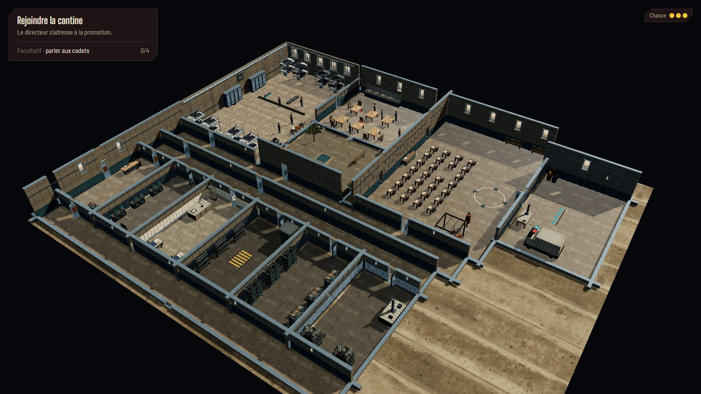
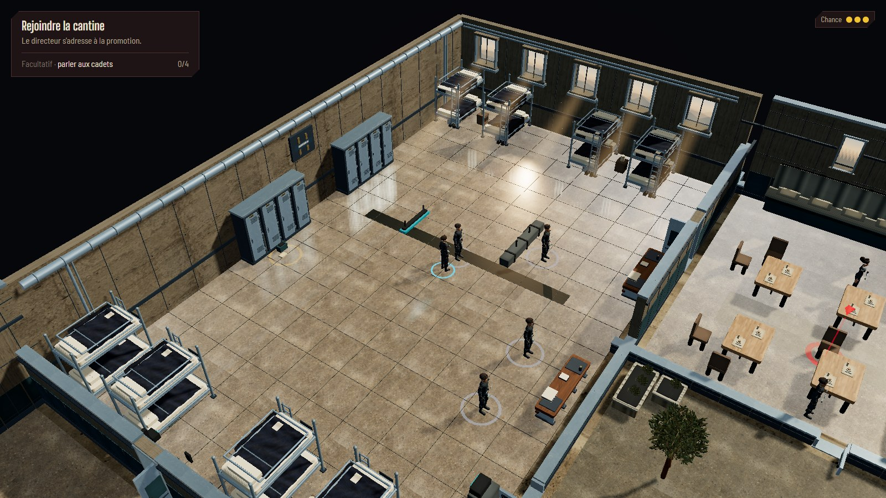
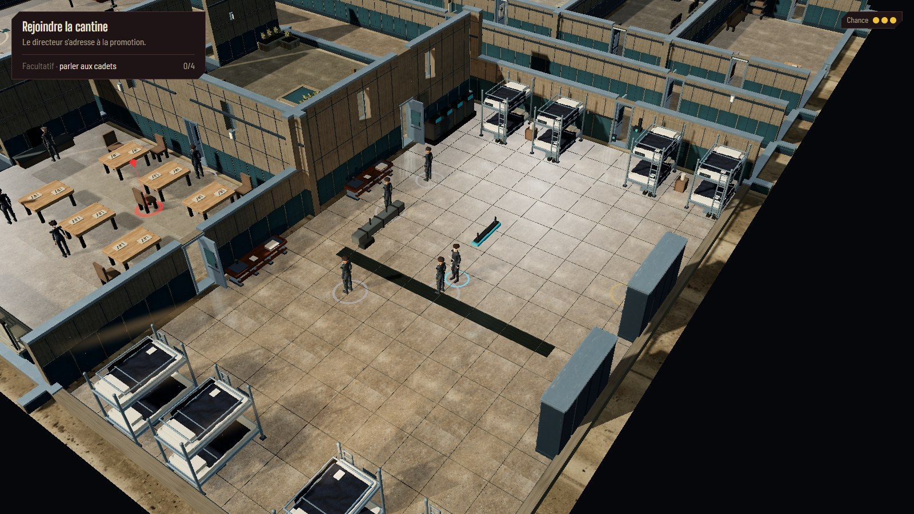
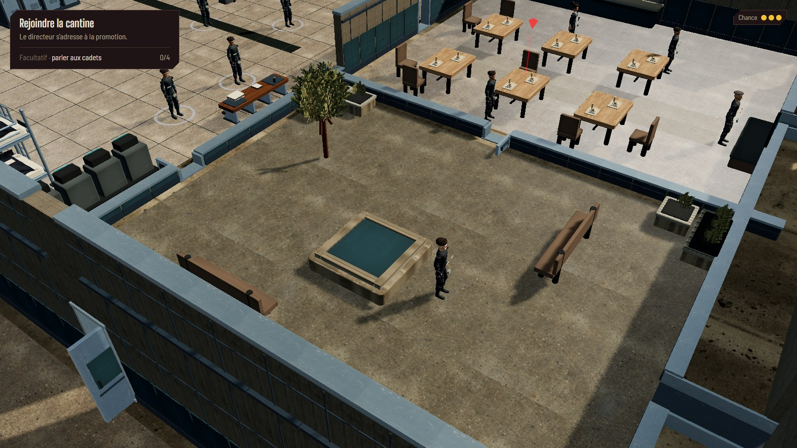
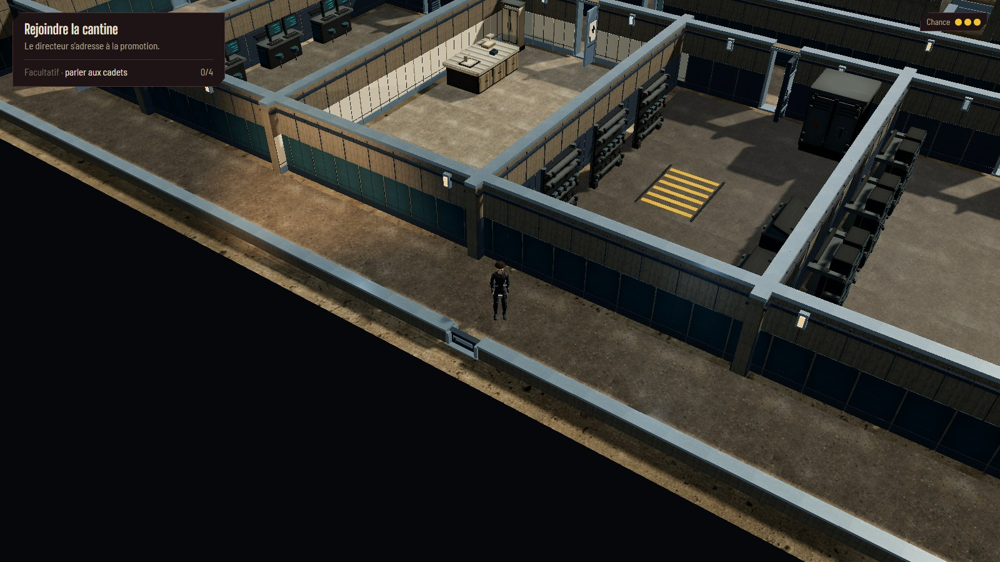
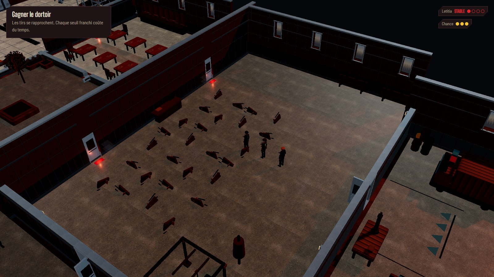
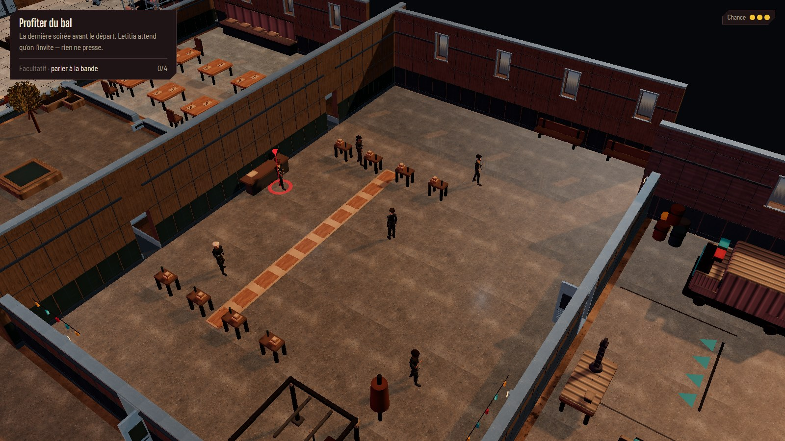

# HOLT — revue du déploiement du décor AAA

Revue du 2 octobre 2026. H0–H14 couvrent les onze pièces et les trois circulations
sur HOLT et HOLT-nuit. H15 clôt les raccords, la lisibilité et le budget cumulé.
Le [journal des lots](../process/HOLT-AAA-ROLLOUT-PLAN.md) conserve leurs captures
intermédiaires ; les images ci-dessous montrent la reprise finale de la caméra et
des cloisons. Décision : [ADR 0037](../process/adr/0037-enveloppe-et-profils-visuels-holt.md).

## Résultat livré

Dortoir, cantine, cour, entraînement, garage, administration, interface, infirmerie,
armurerie, archives et local technique disposent de murs finis, sols et matières,
portes thématiques, mobilier détaillé et éclairage adapté. Les couloirs de ceinture,
est et ouest utilisent la même enveloppe. Les variantes bal et fuite conservent
leur composition et leurs conditions de jeu. Le centre d'examen, les conduits et
le campement ne sont pas inclus. Les modèles, animations et outils des personnages
relèvent du travail séparé du propriétaire.

Les corrections demandées pendant la revue s'appliquent à toute l'école :

- Une structure commune par séparation, avec des finitions propres aux deux faces.
  Les cloisons intérieures font **2,45 m dès la construction**, contre **4,9 m**
  pour les façades extérieures et celles qui donnent sur la cour ouverte.
- Un plan canonique par alignement contigu remplace les centres qui sautaient de
  0,5 m aux seuils. Corps, portes, fenêtres, plinthes, appliques et conduites suivent
  ce même plan. Les deux extrémités du pilote rejoignent les murs ouest et sud.
  Les couvre-murs continuent aussi au-dessus des portes.
- La perspective plonge à environ **40°**, contre 29° dans le pilote initial.
  L'enveloppe apparaît finie avant la découverte des contenus. Entrer dans une autre
  salle ne change plus la hauteur d'une cloison. Un tronçon qui masque réellement
  le meneur peut encore être abaissé pour préserver sa visibilité.
- Les fenêtres sont étroites et réellement découpées. Les baies extérieures donnent
  sur les Badlands ; les baies partagées ne révèlent la cour ou un voisin qu'après
  découverte. Les portes conservent leurs vrais identifiants et états.
- Un seul miroir et une seule pool locale de lumières sont réaffectés à la zone
  occupée. Le reflet planaire décroît aux zooms 26–34 et disparaît en vue large.
  Armurerie et archives gardent un sol mat, avec l'environnement de réflexion.
  Les éléments de plafond qui gênaient la lecture sont retirés.

Les noms des personnages restent au survol/appui dans le HUD HTML et n'entrent
pas dans le miroir. Clic, survol, déplacement de caméra et projections suivent
la caméra effectivement affichée. L'asset de feuillage alpha est réemployé par
l'arbre et les jardinières : [prompt et provenance](HOLT-AAA-ASSETS.md).

## Preuves visuelles finales

La revue finale examine les quatre orientations du dortoir, de la cour et du
couloir ouest, les deux angles de l'armurerie, ainsi que les cadrages normaux et
larges de jour et de nuit, ainsi que deux angles du bal. Les preuves H1–H14 documentent les autres pièces ; leur
caméra et leurs hauteurs ont ensuite reçu le même correctif global de H15.

## Mesures cumulées

Chromium, ANGLE D3D11, **GTX 1070**, viewport **1920 × 1080**, personnages présents,
toutes les pièces découvertes. Mesures successives, sans build ou autre navigateur
concurrent : échauffement de 45 images, puis 180 intervalles requestAnimationFrame.
Les nombres d'appels incluent les passes d'ombres, de reflet et de composition.

| Cadrage | DPR | p50 | p95 | p99 | Appels | Triangles |
| --- | ---: | ---: | ---: | ---: | ---: | ---: |
| Cantine, rapproché, jour | 1 | 16,7 ms | 33,4 ms | 33,4 ms | 2 046 | 3 465 368 |
| École entière, jour | 1 | 16,7 ms | 33,4 ms | 33,4 ms | 2 669 | 3 477 380 |
| Dortoir, reflet actif | 1 | 33,3 ms | 33,4 ms | 33,4 ms | 2 515 | 4 047 764 |
| Entraînement, fuite | 1 | 16,7 ms | 33,4 ms | 33,4 ms | 2 159 | 2 882 020 |
| École entière, fuite | 1 | 16,7 ms | 33,4 ms | 33,4 ms | 2 331 | 2 858 028 |
| Cantine, rapproché, jour | 1,5 | 16,7 ms | 33,4 ms | 33,4 ms | 2 068 | 3 465 632 |

Le palier observé à 33,4 ms correspond à environ 30 ips, à 0,1 ms du seuil nominal
33,3 ms. Ces relevés courts soutiennent la cible demandée dans ces vues ; ils ne
constituent pas une mesure de chaque instant d'une partie entière. Le DPR 1,5 est
contrôlé sur la cantine seulement. La vue du dortoir conserve le miroir à son gain
normal ; aucun relevé final ne force artificiellement sa désactivation. Les deux
premiers relevés précèdent seulement l'ajout des petits couvre-murs des portes ;
le contrôle à DPR 1,5 et les relevés nocturnes les incluent.

## Vérification

- `npm run verify` : **760 tests dans 51 fichiers**, typage, lint et build.
  Les tests globaux couvrent les faces de toute l'école, les raccords collinéaires
  et perpendiculaires, les hauteurs, la coupe stable au changement de pièce,
  la projection/clic aux quatre angles et la destruction des ressources propres.
- Les **huit parcours e2e** exploration/chapitre 2 passent : chapitres complets, interactions au clic, grille nocturne et reprise de partie. Le contrôle de clic garde 30 secondes pour la marche réelle à travers toute l'école, sans contourner le déplacement ni le déclenchement à l'arrivée.
- Audit de **42 visites** : quatorze zones sur `ch1.hub`, `ch2.bal` et `ch2.fuite`.
  Profil et zone actifs corrects, perspective continue, aucun cumul des lumières
  pilotes et de la pool HOLT, aucune erreur de page.
- Trois cycles HOLT → centre d'examen → bal : les deux derniers relevés passent
  de **249 à 247 géométries** et de **96 à 94 textures**, sans croissance après
  échauffement. Redimensionnement à 1280 × 720 contrôlé sans erreur.

Pour revoir le résultat, démarrer `npm run dev` puis ouvrir
[HOLT au temps libre](http://localhost:5173/cyberpunk-holt/?scene=ch1.hub&seed=holt-aaa-review).
`A`/`E` tournent la caméra, la molette zoome et `C` recentre sur le meneur.
Les captures avec toutes les pièces découvertes servent à contrôler l'enveloppe ;
en jeu, les contenus restent soumis à la découverte normale.